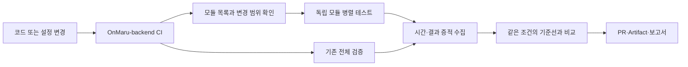

# OnMaru Backend Pipeline Toolkit

이 저장소는 여러 runtime과 모듈을 가진 백엔드의 CI를 측정하고, 병렬 테스트 결과를 안전하게 해석하며, release 간 추세를 비교하기 위한 재사용 도구 모음입니다. 애플리케이션에 라이브러리로 포함하지 않고 GitHub Actions의 version-pinned reusable workflow와 CLI로 사용합니다.

OnMaru-backend의 CI가 느려지는 이유는 테스트가 많다는 사실 하나로 설명되지 않습니다. Spring의 여러 Gradle 모듈, FastAPI 품질 검사, 계약 검증처럼 성격이 다른 작업이 한 줄로 이어지면, 독립적으로 실행할 수 있는 작업도 앞선 작업을 기다려야 합니다. 이 Toolkit은 그 대기 시간을 줄이는 병렬 실행을 돕되, 결과가 우연히 빨랐던 것인지 실제 개선인지도 함께 확인하도록 설계되었습니다.

## OnMaru-backend에 적용하는 CI는 검증·측정·개선을 분리합니다

일반 CI는 “테스트가 통과했는가”를 확인합니다. 이 Toolkit을 OnMaru-backend에 적용할 때의 목표 구조는 여기에 “얼마나 걸렸는가”, “무엇이 가장 오래 걸렸는가”, “변경 뒤에도 같은 조건에서 더 나아졌는가”를 추가합니다. 빠르게 끝난 한 번의 실행을 성과로 취급하지 않고, 같은 조건에서 반복한 결과를 기준선으로 남깁니다.



이 흐름에서 OnMaru-backend는 실제 테스트를 실행하고, Toolkit은 어떤 모듈을 함께 실행할지 계산하고 증적을 읽기 쉬운 결과로 정리합니다. 그림의 각 상자는 별도 기능을 뜻하지만, 실제로는 GitHub Actions workflow와 artifact를 통해 연결됩니다. 서비스 운영 DB나 서비스 코드에 Toolkit을 설치하지 않아도 되는 이유가 여기에 있습니다.

현재 consumer에는 기존 serial `verify` CI와 기준선 수집 절차가 있고, module matrix를 기존 required check에 연결하는 fan-out/fan-in 전환은 별도 rollout으로 진행합니다. 따라서 이 README의 병렬 matrix 설명은 “이미 모든 PR에서 대체된 구조”라는 뜻이 아니라, 기존 검증을 유지하면서 단계적으로 붙이는 운영 모델입니다. 기준선이 먼저 필요한 이유도 이 때문입니다. 전환 전과 후의 실제 시간을 같은 방법으로 비교해야 개선 여부를 설명할 수 있습니다.

## 두 저장소는 역할을 나누어 안전하게 협력합니다

Toolkit이 서비스 배포 권한이나 비밀값까지 가지면 재사용은 쉬워 보일 수 있지만, 한 저장소의 실수가 모든 consumer에 영향을 줄 수 있습니다. 반대로 Toolkit이 분석 규칙과 workflow 계약만 제공하고 consumer가 실제 명령과 권한을 소유하면, 새 모듈이 늘어나도 안전한 경계를 유지할 수 있습니다.

| 영역 | OnMaru-backend가 소유하는 것 | 이 Toolkit이 제공하는 것 |
| --- | --- | --- |
| 테스트 | Gradle·pytest 명령, module catalog, fixture | catalog 검증, 변경 영향 계산 |
| CI 실행 | trigger, runner, cache, 병렬 한도 | reusable workflow와 fan-out/fan-in 구조 |
| 측정 | 동일 commit의 serial 실행, Actions artifact | evidence 계약, 비교·추세 렌더링 |
| 운영 | 배포, promotion, 자격 증명, 보관 정책 | read-only 분석과 결과 상태 |

Toolkit은 consumer의 **런타임 의존성**이 아닙니다. Toolkit workflow는 consumer의 자격 증명이나 deployment credential을 요구하지 않으며, fork PR에는 secret을 전달하지 않습니다. consumer의 source, 원시 로그, 서비스 비밀값을 이 저장소에 커밋하지 않는 것도 같은 경계의 일부입니다.

## 변경 범위를 읽어 병렬 테스트를 구성합니다

OnMaru-backend는 `.github/benchmark-modules.yml`에 모듈별 경로와 테스트 명령을 기록합니다. 예를 들어 catalog 모듈의 파일만 바뀌면 catalog와 그 결과에 의존하는 모듈을 우선 실행할 수 있습니다. 공통 Gradle 설정이나 workflow 파일이 바뀌었거나 어떤 모듈인지 판단할 수 없으면, 안전을 위해 전체 suite를 실행합니다.

Toolkit의 `module-plan`은 이 목록과 변경 경로를 읽어 실행 계획을 만들고, `module-benchmark.yml`은 계획을 matrix로 나눕니다. 서로 독립적인 모듈은 동시에 실행하고, resource-heavy 작업은 동시성 한도를 지켜 runner가 과부하되지 않게 합니다. 마지막 aggregate 단계는 각 결과를 한 곳에 모아 critical path와 실패 상태를 계산하고, verify 단계는 branch protection이 읽을 수 있는 하나의 결론을 남깁니다.

실패한 테스트나 artifact 누락은 성능 저하라는 뜻이 아닙니다. 이런 경우 결과는 `failed` 또는 `inconclusive`로 남기며, 성능이 나빠졌다고 단정하지 않습니다. 이 구분이 없으면 테스트 인프라 문제를 코드 성능 문제로 잘못 해석할 수 있습니다.

## Consumer에서 module benchmark를 호출하는 방법

consumer repository에 module catalog와 caller workflow를 둡니다. 아래는 최소 호출 예시입니다. `<40-character-toolkit-commit-sha>`는 검증한 Toolkit commit SHA로 교체하며, branch나 mutable tag 대신 항상 40자리 immutable SHA를 사용합니다.

```yaml
jobs:
  module-benchmark:
    uses: YRootLab/OnMaru-backend-ci-toolkit/.github/workflows/module-benchmark.yml@<40-character-toolkit-commit-sha>
    with:
      catalog_path: .github/benchmark-modules.yml
      toolkit_ref: <40-character-toolkit-commit-sha>
      mode: pr
      max_parallel: 4
      baseline_ref: develop
      comment_mode: summary
```

`catalog_path`와 모든 `test_command`는 OnMaru-backend가 소유합니다. Toolkit은 caller runner에서 그 명령을 실행해 `module-benchmark-report` artifact와 result, comparison ID, critical path output을 caller에 돌려줍니다. 모듈을 새로 추가할 때는 서비스에 Toolkit 코드를 import하는 대신 catalog에 한 항목을 추가하고 테스트 명령을 검증하면 됩니다. rollout 중에는 기존 `verify`를 required check로 유지하고, module benchmark의 artifact와 result가 충분히 쌓인 뒤 branch rule에 연결합니다.

## 기준선은 같은 출발선에서 반복해 만듭니다

병렬화 전후 시간을 비교하려면 실행 조건이 같아야 합니다. OnMaru-backend는 같은 commit과 설정에서 CI를 **세 번** 성공시킨 뒤, consumer collector로 `serial-baseline.json`을 만듭니다. 변경 후에도 같은 방법으로 세 번 수집하고 두 artifact를 비교합니다. 한 번의 실행은 GitHub-hosted runner의 대기, 다운로드 속도, cache 상태에 영향을 받을 수 있으므로 중앙값을 사용합니다.

비교 가능한 결과에는 아래 조건이 같아야 합니다.

- runner image와 아키텍처
- dependency mode와 cache 상태
- Java/Python 버전
- 실행한 suite·명령과 유효 표본 수

GitHub Actions API만으로 CPU·메모리 수치를 얻지 못하면 이를 추정하거나 `0으로 바꾸지 않는다`. 해당 수치는 수집 불가로 남기고 wall-clock 중앙값만 비교합니다. 이 원칙 덕분에 보고서가 실제로 측정하지 않은 자원 사용량을 사실처럼 보여 주지 않습니다.

OnMaru-backend의 collector와 전후 비교 명령은 [CI 기준선 수집과 비교](https://github.com/YRootLab/OnMaru-backend#ci-%EA%B8%B0%EC%A4%80%EC%84%A0-%EC%88%98%EC%A7%91%EA%B3%BC-%EB%B9%84%EA%B5%90)에서 확인할 수 있습니다. collector workflow와 artifact 보관 기간은 각 consumer repository가 관리하며, Toolkit은 evidence schema와 해석 원칙을 일관되게 적용합니다.

## Release에서는 이전 버전과의 추세를 확인합니다

PR은 빠른 피드백이 중요하므로 영향을 받은 모듈을 중심으로 실행합니다. `develop`과 nightly는 전체 suite의 증적을 쌓고, release는 충분한 반복 실행과 immutable evidence를 남깁니다. release manifest에는 tag뿐 아니라 commit SHA, image digest, configuration hash, runner profile, run ID를 남깁니다. 이전 버전이라도 조건이 다르면 Toolkit은 임의의 다른 기준선을 선택하지 않고 `inconclusive`를 반환합니다.

```bash
PYTHONPATH=src python -m pipeline_toolkit.cli trend compare \
  --history-root ./release-evidence \
  --candidate v1.3.0 \
  --baseline previous \
  --metric pipeline.wall_clock \
  --format markdown
```

이 비교 결과는 배포를 자동으로 승인하거나 막지 않습니다. consumer가 자신의 branch protection과 release 정책에 맞춰 결과를 사용합니다. 즉 CD는 OnMaru-backend가 빌드, 배포, health check, rollback과 protected environment 승인을 소유하고, Toolkit은 release 전후의 evidence와 설명 가능한 판정을 제공합니다. Toolkit의 역할은 재현 가능한 증적과 설명 가능한 판정을 만드는 데까지입니다.

## 상세 계약과 개발 검증을 확인할 수 있습니다

모듈별 병렬 실행의 입력·출력·안전 규칙은 [OnMaruBE parallel CI benchmark PRD](docs/prd/onmarube-parallel-ci-benchmark.md)에, release evidence의 보관·비교 규칙은 [release trend comparison PRD](docs/prd/release-trend-comparison.md)에 정리되어 있습니다.

Toolkit 자체를 검증하려면 다음 명령을 실행합니다.

```bash
python -m pip install -e '.[test]'
bash scripts/verify_toolkit.sh
```

검증은 CLI, evidence contract, 통계 비교, 보고서 렌더링, reusable workflow 보안 규칙을 함께 확인합니다.
