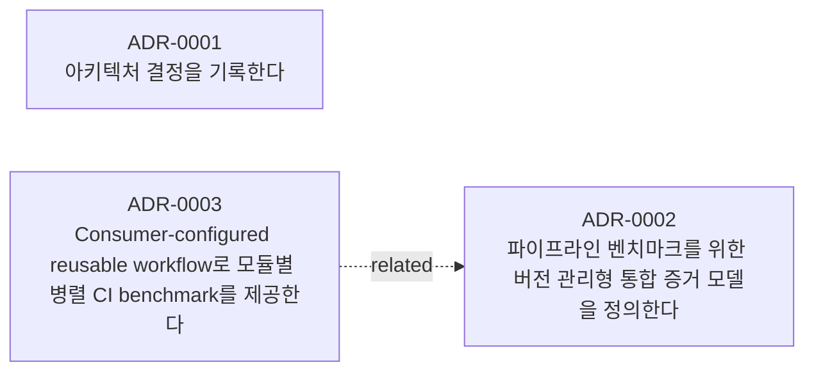

# 결정 기록

## 상태별

### 승인됨
- [ADR-0001 — 아키텍처 결정을 기록한다](0001-record-architecture-decisions.md)

### 제안됨
- [ADR-0002 — 파이프라인 벤치마크를 위한 버전 관리형 통합 증거 모델을 정의한다](0002-versioned-unified-evidence-model.md)
- [ADR-0003 — Consumer-configured reusable workflow로 모듈별 병렬 CI benchmark를 제공한다](0003-consumer-configured-reusable-workflow.md)

## 태그별

### architecture
- [ADR-0002 — 파이프라인 벤치마크를 위한 버전 관리형 통합 증거 모델을 정의한다](0002-versioned-unified-evidence-model.md)
- [ADR-0003 — Consumer-configured reusable workflow로 모듈별 병렬 CI benchmark를 제공한다](0003-consumer-configured-reusable-workflow.md)

### benchmark
- [ADR-0002 — 파이프라인 벤치마크를 위한 버전 관리형 통합 증거 모델을 정의한다](0002-versioned-unified-evidence-model.md)
- [ADR-0003 — Consumer-configured reusable workflow로 모듈별 병렬 CI benchmark를 제공한다](0003-consumer-configured-reusable-workflow.md)

### ci
- [ADR-0003 — Consumer-configured reusable workflow로 모듈별 병렬 CI benchmark를 제공한다](0003-consumer-configured-reusable-workflow.md)

### github-actions
- [ADR-0003 — Consumer-configured reusable workflow로 모듈별 병렬 CI benchmark를 제공한다](0003-consumer-configured-reusable-workflow.md)

### observability
- [ADR-0002 — 파이프라인 벤치마크를 위한 버전 관리형 통합 증거 모델을 정의한다](0002-versioned-unified-evidence-model.md)

### process
- [ADR-0001 — 아키텍처 결정을 기록한다](0001-record-architecture-decisions.md)

### schema
- [ADR-0002 — 파이프라인 벤치마크를 위한 버전 관리형 통합 증거 모델을 정의한다](0002-versioned-unified-evidence-model.md)

### security
- [ADR-0003 — Consumer-configured reusable workflow로 모듈별 병렬 CI benchmark를 제공한다](0003-consumer-configured-reusable-workflow.md)

## 영향 경로별

### `.github/workflows/`
- [ADR-0003 — Consumer-configured reusable workflow로 모듈별 병렬 CI benchmark를 제공한다](0003-consumer-configured-reusable-workflow.md)

### `docs/decisions/`
- [ADR-0001 — 아키텍처 결정을 기록한다](0001-record-architecture-decisions.md)

### `docs/prd.md`
- [ADR-0003 — Consumer-configured reusable workflow로 모듈별 병렬 CI benchmark를 제공한다](0003-consumer-configured-reusable-workflow.md)

### `docs/prd/`
- [ADR-0003 — Consumer-configured reusable workflow로 모듈별 병렬 CI benchmark를 제공한다](0003-consumer-configured-reusable-workflow.md)

### `docs/to-be/`
- [ADR-0003 — Consumer-configured reusable workflow로 모듈별 병렬 CI benchmark를 제공한다](0003-consumer-configured-reusable-workflow.md)

### `schemas/`
- [ADR-0002 — 파이프라인 벤치마크를 위한 버전 관리형 통합 증거 모델을 정의한다](0002-versioned-unified-evidence-model.md)

### `src/pipeline_toolkit/`
- [ADR-0003 — Consumer-configured reusable workflow로 모듈별 병렬 CI benchmark를 제공한다](0003-consumer-configured-reusable-workflow.md)

### `src/pipeline_toolkit/analysis/`
- [ADR-0002 — 파이프라인 벤치마크를 위한 버전 관리형 통합 증거 모델을 정의한다](0002-versioned-unified-evidence-model.md)

### `src/pipeline_toolkit/collectors/`
- [ADR-0002 — 파이프라인 벤치마크를 위한 버전 관리형 통합 증거 모델을 정의한다](0002-versioned-unified-evidence-model.md)

### `src/pipeline_toolkit/normalize/`
- [ADR-0002 — 파이프라인 벤치마크를 위한 버전 관리형 통합 증거 모델을 정의한다](0002-versioned-unified-evidence-model.md)

### `src/pipeline_toolkit/reports/`
- [ADR-0002 — 파이프라인 벤치마크를 위한 버전 관리형 통합 증거 모델을 정의한다](0002-versioned-unified-evidence-model.md)

### `tests/fixtures/`
- [ADR-0002 — 파이프라인 벤치마크를 위한 버전 관리형 통합 증거 모델을 정의한다](0002-versioned-unified-evidence-model.md)

## 시간순 (최신순)

- 2026-09-23 — [ADR-0001 — 아키텍처 결정을 기록한다](0001-record-architecture-decisions.md)
- 2026-09-23 — [ADR-0002 — 파이프라인 벤치마크를 위한 버전 관리형 통합 증거 모델을 정의한다](0002-versioned-unified-evidence-model.md)
- 2026-09-23 — [ADR-0003 — Consumer-configured reusable workflow로 모듈별 병렬 CI benchmark를 제공한다](0003-consumer-configured-reusable-workflow.md)

## 관계

### 대체 이력

### 관련

- ADR-0003 "Consumer-configured reusable workflow로 모듈별 병렬 CI benchmark를 제공한다" 관련: ADR-0002 "파이프라인 벤치마크를 위한 버전 관리형 통합 증거 모델을 정의한다"

