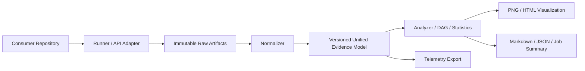

# PRD 구현 가정 기반 CI/CD Toolkit 갭 리뷰

## 1. 리뷰 범위와 전제

이 문서는 `docs/prd.md`의 요구사항이 모두 구현되었다고 가정했을 때, 운영 가능한 재사용형 CI/CD benchmark toolkit으로서 남는 설계·검증·운영 공백을 평가한다.

이번 리뷰는 다음 관점을 함께 적용했다.

- Backend Developer: command 실행 신뢰성, 외부 도구 연동, 실패 복구, API·데이터 경계
- Observability Engineer: metric provenance, cardinality, 로그·트레이스·알림, 시계열 보존
- Software Architecture Reviewer: 모듈 경계, 의존 방향, 확장성, C4 구조, ADR 후보

현재 workspace에는 PRD와 README만 있으므로 실제 `onmaru-backend` 코드, workflow, Dockerfile, 테스트 결과를 사실로 평가하지 않는다. 아래 “현재 상태”는 PRD에 정의된 목표이고, “부족한 점”은 그 목표를 구현했다는 가정 아래에도 필요한 계약과 운영 장치다.

## 2. 종합 평가

| 영역 | 점수 (0~5) | 판정 | 핵심 이유 |
|---|---:|---|---|
| 목표·범위 정의 | 4 | 양호 | consumer/toolkit 경계와 lifecycle이 명확하다. |
| Unified benchmark model | 2 | 보완 필요 | 기본 필드는 있으나 provenance, 단위, 품질 상태, schema evolution이 부족하다. |
| 외부 도구 실행 신뢰성 | 2 | 보완 필요 | timeout, cancellation, retry, partial failure 계약이 없다. |
| DAG·critical path 분석 | 2 | 보완 필요 | GitHub Actions의 matrix, conditional, retry, queue time 정책이 없다. |
| 통계적 비교 | 2 | 보완 필요 | 반복 실행, warm-up, noise, sample size, confidence 정책이 없다. |
| Observability | 2 | 보완 필요 | 향후 export 방향은 있으나 toolkit 자체 telemetry와 alert 운영 계약이 없다. |
| 시각화·보고서 | 3 | 조건부 양호 | 시각화 목록은 충분하지만 missing data와 provenance 표현이 부족하다. |
| 보안·공급망 | 1 | 위험 | untrusted PR, token, secret redaction, HTML 보안 경계가 정의되지 않았다. |
| CI/CD adoption | 2 | 보완 필요 | reusable workflow와 report는 정의됐지만 rollout, rollback, permission gate가 부족하다. |

**종합 판정: 2.2/5 — 설계 방향은 좋지만 production-ready toolkit으로 보기에는 실행 신뢰성, 데이터 신뢰도, 보안 경계가 부족하다.**

## 3. 잘 정의된 부분

- Inspect → Measure → Collect → Normalize → Analyze → Compare → Visualize → Report → Optimize lifecycle이 명확하다.
- consumer repository의 소스와 테스트를 toolkit에 복제하지 않는 경계가 분명하다.
- wall-clock과 work duration을 분리한 것은 serial→parallel 최적화의 핵심 개념이다.
- raw artifact, normalized data, chart, Markdown/HTML report를 분리한 산출물 구조가 합리적이다.
- critical path, affected testing, cache effectiveness, CPU/memory trade-off까지 분석 범위가 넓다.
- 초기 regression은 warning/report-only로 시작하고 안정화 후 gate화한다는 방향이 안전하다.
- Gradle, pytest, Docker, GitHub Actions를 직접 재구현하지 않고 adapter/collector로 통합하려는 방향이 적절하다.

## 4. 핵심 부족점과 권고

### 4.1 Unified model은 “측정값”보다 “측정 증거”를 표현해야 한다

현재 예시 모델은 `durationMs`, CPU, memory, tests, exitCode를 담지만 다음 정보가 없다.

- 측정 출처: tool name/version, collector version, runner image, OS, architecture
- 실행 식별자: repository, commit SHA, workflow/run/job/attempt, benchmark ID
- 시간 의미: wall clock인지 monotonic duration인지, timezone, clock skew
- 품질 상태: observed, estimated, missing, partial, invalid
- 단위와 집계 방식: milliseconds/seconds, sum/max/median/p95
- 환경 상태: cold/warm cache, parallelism, CPU limit, memory limit
- schema compatibility와 migration 정책

**권고:** raw artifact는 immutable하게 보존하고 normalized schema에는 `schemaVersion`, `source`, `execution`, `environment`, `measurementQuality`, `provenance`를 필수화한다. 분석·시각화·보고서는 collector raw 파일을 직접 읽지 않도록 한다.

### 4.2 command runner는 toolkit의 신뢰 경계다

Gradle, pytest, Docker, k6, `/usr/bin/time`, GitHub API를 실행하는 계층은 단순 subprocess wrapper가 아니다.

필수 계약:

- 명시적 timeout과 process-tree termination
- SIGTERM/SIGKILL 전달 및 종료 원인 보존
- stdout/stderr 분리 저장
- non-zero exit와 collector parse failure 분리
- retry 대상과 retry 불가 오류 구분
- command, arguments, working directory, environment redaction 기록
- partial output을 실패로 버리지 않고 quality flag와 함께 보존
- shell 문자열 실행 금지, argument array와 allowlist 사용

**판정:** 이 계약이 없으면 benchmark 결과가 실패했는데도 “성능 저하”로 보고될 수 있다.

### 4.3 GitHub Actions DAG는 단순 job graph보다 복잡하다

PRD의 DAG 모델은 기본 dependency graph와 critical path 개념은 갖추었으나 실제 workflow에서 다음을 명시하지 않는다.

- matrix job을 하나의 logical node 또는 여러 execution node로 볼지
- `if` 조건으로 skipped된 job의 시간·의존성 처리
- queued time, runner allocation time, execution time 분리
- retry/attempt와 cancelled run 처리
- reusable workflow와 nested job 식별
- dynamic `needs`와 결과 전파
- failed node 뒤의 downstream node 처리
- zero-duration node와 missing timestamp 처리

**권고:** `Workflow → Job → Attempt → Step` 계층을 보존하고, critical path 계산은 execution graph와 logical graph를 별도로 제공한다. 미확인 edge는 추정하지 말고 `unknown` 상태로 보고한다.

### 4.4 wall-clock과 work duration 산식은 fixture로 검증해야 한다

parallel pipeline에서는 `sum(duration)`과 `max(end)-min(start)`가 다르다. 그러나 queue time, setup overhead, retry, idle gap을 분리하지 않으면 개선 효과가 과장될 수 있다.

최소 검증 fixture:

- 완전 직렬 DAG
- 독립 두 job의 완전 병렬 DAG
- diamond DAG
- 겹치지 않는 idle gap
- retried job
- skipped job
- 일부 timestamp가 없는 실행

각 fixture에서 total work, pipeline wall-clock, critical path, overlap ratio의 기대값을 고정해야 한다.

### 4.5 benchmark 비교에는 통계적 유효성 기준이 필요하다

한 번의 baseline/candidate 실행은 noisy CI runner에서 결론이 될 수 없다.

추가해야 할 정책:

- warm-up 실행 수와 측정 실행 수
- cold cache/warm cache 분리
- 최소 sample size
- median, p95, 분산 또는 confidence interval
- 실패·취소·runner interruption의 exclusion rule
- baseline 선택 우선순위
- 결과가 통계적으로 불충분할 때 `inconclusive` 판정
- regression threshold와 최소 절대 변화량의 결합

**권고:** 초기 버전에서는 median과 raw samples를 함께 표시하고, sample이 부족하면 CI fail이 아닌 `insufficient evidence`로 보고한다.

### 4.6 Observability는 향후 export가 아니라 현재 실행의 진단 수단이어야 한다

PRD는 OpenTelemetry와 Prometheus export를 향후 연동 대상으로 정의한다. 그러나 toolkit 자체에서 수집 실패·성능 저하·데이터 품질을 추적할 수 있는 telemetry 계약이 없다.

필수 내부 metric 예시:

- `toolkit_collection_duration_seconds`
- `toolkit_collection_failures_total{collector,reason}`
- `toolkit_normalization_records_total{source,status}`
- `toolkit_report_generation_duration_seconds`
- `toolkit_missing_artifacts_total{artifact_type}`
- `toolkit_benchmark_runs_total{result}`

주의할 점:

- commit SHA, test name, full path는 Prometheus label이 아니라 artifact/report 필드로 둔다.
- `repository`, `env`, `runtime`, `collector`, `status`처럼 제한된 저카디널리티만 label로 허용한다.
- metric마다 단위, aggregation, retention, owner를 문서화한다.
- 로그에는 command 실패 원인과 trace/run correlation ID를 남긴다.

### 4.7 보안 경계가 가장 큰 미정 영역이다

Consumer repository와 PR 변경 코드를 실행하는 toolkit은 신뢰할 수 없는 입력을 받을 수 있다.

필수 보완:

- fork PR에서는 secret이 필요한 단계와 benchmark 단계를 분리
- GitHub token은 read-only 최소 권한
- deployment/migration은 benchmark suite에서 기본 비활성화하고 명시적 approval 필요
- 환경변수·stdout·HTML report에서 secret/PII redaction
- HTML report의 escaping과 path traversal 방지
- Docker socket 접근 여부와 권한 모델 명시
- dependency, image, SBOM/security scan 결과의 provenance 보존
- arbitrary command 실행은 config allowlist와 trusted-runner 정책 적용

### 4.8 report는 숫자뿐 아니라 신뢰도와 provenance를 보여줘야 한다

모든 표·차트·요약은 다음을 표시해야 한다.

- source run과 commit
- 측정 시각과 runner
- baseline/candidate 정의
- missing/estimated/partial 데이터 여부
- sample count와 통계 방법
- raw artifact 링크
- 계산식 또는 aggregation rule

특히 `Improvement 39.7%`만 표시하면 cache 상태나 sample 수를 숨길 수 있으므로, raw duration·sample count·resource change를 함께 노출해야 한다.

## 5. 권장 아키텍처

권장 의존 방향은 `core model ← adapters/collectors ← runners`가 아니라, core domain이 외부 도구를 모르게 하는 방향이다.

- `runners`: 실행만 담당하고 분석하지 않는다.
- `collectors`: raw output을 source-specific record로 읽는다.
- `normalizers`: versioned unified model로 변환한다.
- `analysis`: normalized model만 소비한다.
- `visualization/reports`: analysis 결과와 normalized model만 소비한다.
- `github`: API 인증·pagination·rate limit을 캡슐화한다.

현재 PRD에서는 microservices 분리가 필요하지 않다. 초기 구현은 modular monolith로 유지하고, collector/plugin 경계만 안정적으로 만든다.

## 6. 우선순위 로드맵

| 우선순위 | 보완 항목 | 완료 기준 |
|---|---|---|
| P0 | 실행·보안 경계 | timeout, cancellation, redaction, token scope, deployment isolation이 fixture와 문서로 검증됨 |
| P0 | normalized evidence schema | schema version, provenance, quality, environment, execution identity가 검증됨 |
| P0 | DAG correctness | matrix/skipped/retry/failed/partial timestamp fixture가 기대값과 일치함 |
| P1 | 통계 비교 | 반복 실행, cache state, sample count, inconclusive 판정이 보고서에 반영됨 |
| P1 | report provenance | 모든 결과가 raw artifact와 계산식으로 추적 가능함 |
| P1 | resource guardrail | CPU/memory budget과 parallelism limit을 초과하면 경고 또는 중단함 |
| P2 | telemetry export | 저카디널리티 metric과 structured log가 수집·검증됨 |
| P2 | reusable workflow | 최소권한, artifact retention, fork PR 정책을 포함한 adoption fixture가 통과함 |
| P3 | historical trend | 저장소·보존·schema migration·baseline selection 정책이 운영됨 |

## 7. 수용 기준

- 정상·실패·부분 수집 결과를 서로 다른 상태로 보고한다.
- 동일 raw artifact를 다시 처리하면 normalized JSON과 report가 결정론적으로 같다.
- serial/parallel/diamond DAG의 work duration과 wall-clock 계산이 fixture로 검증된다.
- matrix, skipped, retry, cancelled GitHub job이 graph에서 손실되지 않는다.
- baseline 정보가 부족하면 regression을 단정하지 않고 `inconclusive`로 표시한다.
- secret-like 값과 full path가 metric label로 유입되지 않는다.
- HTML, Markdown, Job Summary가 동일한 report model에서 생성된다.
- 모든 성능 수치가 commit/run/tool version/raw artifact로 추적된다.
- consumer source와 test를 toolkit repository에 복제하지 않는다.

## 8. 결론

PRD는 분석 대상과 시각화 목표를 잘 정의하고 있으며, 특히 wall-clock/work duration 분리와 evidence 기반 보고서 방향이 강점이다. 그러나 production toolkit의 품질을 결정하는 부분은 기능 목록보다 **실패한 측정값을 어떻게 구분하는지, DAG를 얼마나 정확히 재구성하는지, 결과를 재현할 수 있는지, untrusted CI 입력을 어떻게 제한하는지**다.

따라서 v0.1.0의 선행 조건은 시각화 개수 확대가 아니라 P0 항목인 실행 신뢰성, versioned evidence model, DAG correctness, 보안 경계를 고정하는 것이다.
