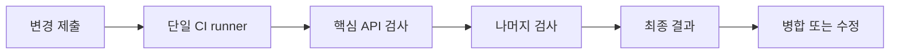

# OnMaru Backend CI 병렬화 관측 보고서: 7분의 대기 시간에서 공정한 개선 측정까지

- 작성일: 2026-09-24
- 대상: `YRootLab/OnMaru-backend`
- 관측 범위: GitHub Actions CI·Module Benchmark·Staging Deploy·Release Please
- 상태: **직렬 병목 확인 완료 / 병렬 구조 검증 완료 / 공식 개선율 측정 전**

## 결론

현재 OnMaru Backend의 `verify` CI는 하나의 runner에서 검사를 차례로 수행하며, 최근 성공 PR에서는 약 400~403초, `develop`의 단일 관측에서는 454초가 걸렸다. Spring API 테스트가 221초로 전체 job의 48.7%를 차지해 가장 긴 대기 경로를 형성한다.

모듈별 병렬 실행은 최대 4개 job을 동시에 시작하고 12개 중 11개 모듈의 성공·근거 artifact 수집을 확인했다. 다만 첫 후보 실행은 AI job의 `uv` 부재로 실패했으므로 316.41초라는 관측값을 개선율로 사용하지 않는다. 원인 수정은 PR #379로 `develop`에 병합됐으며, 다음 성공 표본부터 같은 조건의 직렬·병렬 반복 측정을 진행해야 한다.

## 이 보고서가 답하는 질문

이 보고서는 “현재 CI가 왜 느린가”, “병렬화가 실제로 동작하는가”, “얼마나 빨라졌다고 말할 수 있는가”를 구분해 답한다. 속도 수치는 runner, 캐시, 코드 상태에 따라 흔들릴 수 있다. 따라서 한 번의 빠른 실행보다 비교 가능한 성공 표본을 우선한다.

## 측정 범위와 증거 품질

| 대상 | 실행 결과 | 관측값 | 비교 가능성 | 이 보고서에서의 용도 |
| --- | --- | ---: | --- | --- |
| [직렬 CI run 35940692137](https://github.com/YRootLab/OnMaru-backend/actions/runs/35940692137) | success | job 454초, run 458초 | 단일 표본 | 병목 위치 파악 |
| [최근 PR CI 35942322749](https://github.com/YRootLab/OnMaru-backend/actions/runs/35942322749) | success | job 403초 | 다른 SHA | 운영 관측 범위 |
| [최근 PR CI 35942194992](https://github.com/YRootLab/OnMaru-backend/actions/runs/35942194992) | success | job 400초 | 다른 SHA | 운영 관측 범위 |
| [최근 PR CI 35941255407](https://github.com/YRootLab/OnMaru-backend/actions/runs/35941255407) | success | job 402초 | 다른 SHA | 운영 관측 범위 |
| [병렬 run 35941255870](https://github.com/YRootLab/OnMaru-backend/actions/runs/35941255870) | failed | critical path 316.41초 | 실패·다른 SHA | topology·실패 원인 확인 |
| Staging Deploy·Release Please | 최근 성공 표본 없음 | N/A | 불가 | 배포 lead time 미측정 |

최근 PR CI 세 건의 중앙값은 402초이지만, 서로 다른 commit SHA에서 실행됐다. 따라서 이 값은 “현재 운영상 약 6분 40초가 걸린다”는 설명에는 쓸 수 있어도, 병렬화 전 공식 기준선으로는 쓸 수 없다.

## 변경 전 구조와 병목

현재 `verify` job은 한 runner 안에서 모듈 테스트와 품질 검사를 순서대로 수행한다. 독립적인 테스트도 앞선 단계가 끝나기를 기다리기 때문에, 가장 긴 단계가 전체 완료 시점을 결정한다.

*직렬 CI에서는 핵심 API 검사가 끝나야 나머지 검사의 최종 결과도 확정된다.*

`develop`의 성공 실행 35940692137을 step timestamp로 나눈 결과는 다음과 같다. 합계는 timestamp 경계에 따른 근사치이며, runner queue와 비용을 뜻하지 않는다.

| 단계 | 시간 | 전체 454초 대비 | 관측 해석 |
| --- | ---: | ---: | --- |
| Spring API tests | 221초 | 48.7% | 최대 병목, 병렬화 후에도 critical path 후보 |
| TourAPI adapter tests | 59초 | 13.0% | 두 번째 독립 비용 |
| Node·generated artifact validation | 38초 | 8.4% | 계약·생성물 일관성 검증 |
| 나머지 모듈 tests | 91초 | 20.0% | 독립 module이면 동시에 실행할 수 있는 후보 |
| setup·Python/FastAPI·cleanup | 45초 | 9.9% | 도구 준비와 tail 비용 |

## 병렬화 변경과 실제 관측

병렬화는 테스트를 생략하지 않는다. catalog가 선택한 module을 matrix job으로 분리하고, 최대 4개를 동시에 실행한 뒤 aggregate job이 근거 artifact와 결과를 모은다. 목표는 검증 범위를 유지한 채 개발자가 기다리는 wall-clock 시간을 줄이는 것이다.

첫 Module Benchmark 실행에서 확인된 사실은 다음과 같다.

| 항목 | 관측 결과 | 판정 |
| --- | --- | --- |
| 동시 시작 module 수 | 4 | `max_parallel` 정책 적용 확인 |
| module 결과 | 11 success, 1 failed | 불완전 candidate |
| toolkit checkout·plan·artifact | success | pipeline 연결 확인 |
| AI module command | `uv` 부재로 exit 127 | 실행 환경 결함 |
| aggregate 결과 | failed | fail-closed 정책 정상 동작 |
| longest observed path | 316.41초 | 성과 판정 제외 |

AI job은 fresh runner에서 `uv run pytest`를 호출했지만 `uv`가 준비돼 있지 않았다. 이 문제는 테스트 논리나 병렬화 자체의 실패가 아니라 runtime 준비 계약의 누락이었다. PR #379는 `uv` 설치와 PATH 준비를 module command에 추가했고, `verify`와 AI pytest를 통과한 후 병합됐다.

## 무엇을 개선이라고 말할 수 있고, 무엇을 말할 수 없는가

| 구분 | 현재 판단 | 이유 |
| --- | --- | --- |
| Spring API가 주요 병목이다 | 확정 | 직렬 성공 run에서 전체의 48.7% |
| 최대 4개 module 동시 실행이 가능하다 | 확정 | 실제 Module Benchmark 실행 확인 |
| AI runtime 누락 원인을 수정했다 | 확정 | PR #379 merge·검증 완료 |
| CI가 21% 빨라졌다 | 미확정 | 병렬 후보가 실패했고 비교 조건 불일치 |
| 316.41초가 병렬 기준선이다 | 미확정 | 동일 SHA 반복 성공 표본 아님 |
| CD가 더 빨라졌다 | 미확정 | 성공 배포 표본 없음 |

실패, 취소, timeout, artifact 누락, 또는 commit SHA·runner image·cache state·toolchain·test command가 다른 실행은 개선 및 회귀 판정에서 제외한다. 빠른 실패 실행을 성과로 기록하지 않는 것이 이 측정의 안전 장치다.

## 다음 측정 계획과 판정 기준

| 순서 | 작업 | 완료 조건 | 산출물 |
| --- | --- | --- | --- |
| 1 | 직렬 기준선 수집 (#368) | 동일 SHA의 성공 CI 3회 | median·p95·실패율 manifest |
| 2 | 병렬 caller 성공 확인 (#365) | AI 포함 aggregate success | complete module evidence |
| 3 | 병렬 후보 수집 | 동일 조건의 성공 실행 3회 | median·p95·critical path |
| 4 | 전후 비교 | identity·cache 정책 일치 | delta와 `improved/unchanged/regressed/inconclusive` |
| 5 | CD 추세 수집 (#366) | 성공 deploy 표본 확보 | delivery lead time·실패 분류 |

판정은 다음처럼 한다.

- `improved`: 비교 가능한 성공 표본에서 wall-clock과 critical path가 정책 임계치 이상 줄고, 실패·취소율이 증가하지 않은 경우
- `unchanged`: 차이가 작거나 정책 임계치 미만인 경우
- `regressed`: 비교 가능한 성공 표본에서 유의미하게 느려진 경우
- `inconclusive`: 표본 부족, 비교 조건 불일치, 실패·취소·timeout·artifact 누락이 있는 경우

## 후속 결론

현재 가장 가치 있는 다음 행동은 Spring API를 포함한 독립 module의 성공 병렬 실행을 다시 수집하고, 같은 코드 상태의 직렬 기준선과 비교하는 것이다. 이 과정을 마치기 전까지는 “병렬화가 준비됐다”와 “병목이 확인됐다”까지만 사실로 기록한다. 실제 개선율은 성공한 비교 표본으로 갱신한다.
