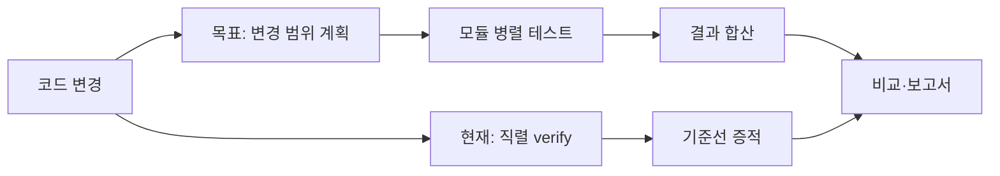

# OnMaru-backend CI/CD를 더 빨리, 그리고 정직하게 개선하는 방법

- 작성일: 2026-09-26
- 대상: `YRootLab/OnMaru-backend`와 `YRootLab/OnMaru-backend-ci-toolkit`
- 관측 기준: 2026-09-25 UTC GitHub Actions 실행 기록
- 상태: **동일 commit SHA의 직렬 기준선 3회 수집 완료 / 병렬 required check 전환과 표준 artifact 발행은 진행 중**

## 먼저 결론부터 보면

OnMaru-backend의 CI는 코드를 배포하기 전에 “이 변경이 안전한가”를 검사하는 자동 점검표다. 현재 required check로 운영 중인 것은 직렬 `verify` 하나다. 한 명의 검사원이 여러 항목을 순서대로 확인하는 방식이라, 앞의 검사가 끝날 때까지 뒤의 독립적인 검사가 기다린다.

같은 코드 상태에서 세 번 다시 실행한 결과, 완료 시간의 중앙값은 **400초(6분 40초)**였다. 이 값은 앞으로 병렬화를 적용한 뒤의 기준선이 된다. 다만 아직 병렬 결과의 같은 조건 성공 표본이 없으므로, “몇 % 빨라졌다”는 실제 개선률을 아직 선언하지 않는다. 빠른 한 번의 실행이나 실패한 실행을 성과로 쓰지 않는 것이 이 구조의 핵심 원칙이다.

## 지금의 흐름과 목표 구조는 다릅니다

현재 흐름은 전수 검사를 한 줄로 실행한다. 안정성에는 도움이 되지만, 예를 들어 관광 API 테스트와 카탈로그 테스트가 서로 영향을 주지 않아도 순서를 기다린다. 목표 구조는 테스트를 줄이는 것이 아니라, 서로 독립적인 검사를 나누어 동시에 시작하고 마지막에 결과를 한 번에 판정하는 방식이다.

그림의 위쪽은 현재 운영 중인 안전장치, 아래쪽은 도입 중인 가속 장치다. 전환 중에도 직렬 `verify`를 유지해 “더 빨라졌지만 일부 테스트를 빼먹었다”는 일이 없게 한다. 병렬 결과가 충분히 쌓이고 합산 단계가 모든 결과를 누락 없이 확인한 뒤에만 required check 전환을 검토한다.

| 구분 | 오늘 실제로 하는 일 | 목표 구조가 추가하는 일 |
| --- | --- | --- |
| Pull Request | 전체 검사를 직렬로 실행해 통과/실패 판단 | 바뀐 영역과 의존 영역을 계산해 독립 모듈을 동시에 검사 |
| `develop`·nightly | 성공 실행의 시간과 결과를 남김 | 전체 모듈의 증적을 반복 수집해 추세 비교 |
| `master`·배포 | 서비스 저장소가 배포·health check·rollback을 소유 | release 전후 증적을 비교해 느려짐이나 실패 패턴을 설명 |
| Toolkit | 서비스 코드를 실행 파일로 포함하지 않음 | 실행 계획, 증적 형식, 비교 규칙, 보고서 렌더링 제공 |

## 누가 무엇을 책임지는가

Toolkit은 OnMaru-backend 안에 라이브러리로 설치되는 제품 코드가 아니다. GitHub Actions가 검증된 Toolkit commit SHA의 재사용 workflow를 호출하는 방식이다. 따라서 실제 테스트 명령, 서비스 비밀값, 배포 권한은 계속 OnMaru-backend에 남고, Toolkit은 “어떤 테스트를 병렬로 돌리고 어떤 수치끼리 비교할지”라는 공통 규칙을 제공한다.

| 주체 | 책임 | 의도적으로 하지 않는 일 |
| --- | --- | --- |
| OnMaru-backend | module catalog, Gradle·pytest 명령, runner·cache, branch protection, 배포와 rollback | 서비스 자격 증명이나 원시 소스 코드를 Toolkit에 넘기지 않음 |
| CI Toolkit | 변경 영향 계획, matrix 실행 계약, evidence schema, critical path·추세 비교, 보고서 생성 | consumer 배포를 승인·실행하거나 secret을 보관하지 않음 |
| GitHub Actions | 정해진 runner에서 job 실행, artifact 보관, check 표시 | 서로 다른 조건의 실행을 자동으로 공정하다고 가정하지 않음 |

새 카탈로그 같은 모듈이 추가되어도 앱이 Toolkit을 import할 필요는 없다. OnMaru-backend의 `.github/benchmark-modules.yml`에 모듈 경로·테스트 명령·의존 관계를 추가하고, Toolkit이 이를 실행 계획으로 바꾼다. 공통 Gradle 설정처럼 영향 범위를 확신할 수 없는 변경은 선택 테스트 대신 전체 suite로 되돌아간다. 속도보다 누락 방지가 우선이다.

## 병렬 자동화는 어떻게 작동하는가

1. 개발자가 PR을 열면 OnMaru-backend가 변경 파일을 확인한다.
2. catalog가 직접 바뀐 모듈과 그 결과에 의존하는 모듈을 찾아 실행 목록을 만든다. 판단할 수 없으면 전체 테스트를 선택한다.
3. 재사용 workflow가 목록을 matrix job으로 나눈다. 독립 모듈은 동시에 실행하되, 무거운 작업이 runner를 서로 방해하지 않도록 `max_parallel` 상한을 둔다.
4. 각 job은 성공·실패, 실행 시간, 환경 식별값을 artifact로 남긴다.
5. aggregate job은 artifact가 빠졌는지와 모든 결과가 성공했는지를 확인한다. 하나라도 누락·실패하면 조용히 통과시키지 않고 실패 또는 `inconclusive`로 남긴다.
6. 기준선과 조건이 같은 성공 표본만 비교해, PR 요약과 상세 보고서에 `improved`, `unchanged`, `regressed`, `inconclusive` 중 하나를 표시한다.

이 중 1번의 기존 직렬 검사는 운영 중이다. 2~5번의 fan-out/fan-in 전환은 [#364](https://github.com/YRootLab/OnMaru-backend/issues/364), Toolkit caller와 affected fallback 연결은 [#365](https://github.com/YRootLab/OnMaru-backend/issues/365)에서 진행한다. 즉 설계와 재사용 구성요소는 준비됐지만, 현재 모든 PR의 required check가 이미 병렬 matrix라는 뜻은 아니다.

## 이번에 확보한 기준선은 무엇을 말해 주는가

아래 세 실행은 모두 동일 commit SHA `34276f201ce6f7b5ffb6e7ab2784eb584a91a699`, 동일한 `develop` ref, 동일한 직렬 `verify`에서 성공했다. 이처럼 출발점을 맞춰야 중앙값이 전후 비교에 의미를 갖는다.

| 표본 | `verify` 실행 시간 | run 전체 시간 | 판정 |
| --- | ---: | ---: | --- |
| [1회차](https://github.com/YRootLab/OnMaru-backend/actions/runs/36159816646) | 413초 | 419초 | 비교 가능 |
| [2회차](https://github.com/YRootLab/OnMaru-backend/actions/runs/36160594916) | 361초 | 372초 | 비교 가능 |
| [3회차](https://github.com/YRootLab/OnMaru-backend/actions/runs/36161322635) | 400초 | 405초 | 비교 가능 |
| 중앙값 | **400초** | **405초** | 직렬 기준선 |

세 표본의 범위는 52초다. GitHub-hosted runner의 준비 상태와 네트워크·cache 영향 때문에 한 번의 실행만으로는 답을 내리지 않는 이유다. 현 시점에서 신뢰할 수 있는 표현은 “이 조건의 직렬 CI 중앙값은 약 6분 40초”까지다.

3회차의 단계 기록에서는 Spring API tests가 209초로 job 시간의 약 52%를 차지했다. 이 단계는 병렬화 후에도 전체 완료 시점을 정할 가능성이 높은 critical path 후보다. 반면 TourAPI와 여러 module test는 차례로 실행되고 있어, 의존 관계와 자원 충돌이 없다는 검증을 거쳐 병렬 후보가 된다.

## 수치를 과장하지 않기 위한 안전장치

측정 자동화는 숫자를 많이 모으는 기능이 아니라, 비교하면 안 되는 숫자를 걸러내는 기능이기도 하다.

| 확인 항목 | 같은 값이어야 하는 이유 | 다르면 어떻게 하는가 |
| --- | --- | --- |
| commit SHA·테스트 명령 | 코드와 검사 범위가 같아야 함 | 비교에서 제외 |
| runner image·아키텍처 | 실행 기계가 달라지면 시간도 달라짐 | 비교에서 제외 또는 별도 기준선 |
| Java/Python 버전·dependency mode | 도구와 의존성 변화가 시간을 바꿀 수 있음 | 비교에서 제외 |
| cache 상태 | warm/cold cache가 결과를 크게 왜곡할 수 있음 | 상태를 기록하고 같은 정책끼리 비교 |
| success·artifact 완전성 | 빠른 실패는 빠른 성공이 아님 | `inconclusive` 또는 실패 처리 |

CPU·메모리(RSS)는 GitHub Actions API만으로 수집할 수 없다. 따라서 해당 값은 `unavailable` 또는 `null`로 보존하며 0으로 기록하지 않는다. 이번 collector도 이 원칙을 따른다. Actions가 제공하는 시작·종료 시각으로 wall-clock 시간은 확인할 수 있지만, 실제 CPU 사용량을 추정해 넣지는 않는다.

표준 `ci-serial-baseline` artifact 발행은 아직 막혀 있다. collector workflow가 `develop`에는 있으나 기본 브랜치 `master`에는 없어서 workflow-dispatch API가 404를 반환했다. 원시 실행 링크와 시간은 [#368](https://github.com/YRootLab/OnMaru-backend/issues/368)에 남겼고, collector가 기본 브랜치에서도 호출 가능해지면 같은 3개 run ID로 immutable artifact를 재발행한다. 이는 측정 실패가 아니라, 증적 보관 경로의 운영 결함이다.

CD lead time도 아직 개선 수치가 없다. 최근 staging 배포에 성공 표본이 없어서 “배포가 몇 분 빨라졌다”는 결론을 낼 수 없다. [#366](https://github.com/YRootLab/OnMaru-backend/issues/366)은 `develop`·nightly·release에서 성공 배포와 benchmark evidence를 연결해 이 빈칸을 채우는 작업이다.

## 앞으로는 무엇이 자동으로 쌓이는가

병렬 rollout 뒤에는 PR마다 단순 통과 여부뿐 아니라 module별 시간, aggregate의 critical path, 환경 식별값이 artifact에 쌓인다. `develop`과 nightly는 전체 suite를 반복해 단기 흔들림을 줄이고, release는 tag·commit SHA·runner profile·configuration hash를 포함한 immutable manifest를 남긴다. Toolkit의 trend comparison은 가장 가까운 이전 release나 명시한 기준선과 비교하고, 조건이 맞지 않으면 억지로 숫자를 내지 않고 `inconclusive`를 반환한다.

보고서는 이 증적에서 다음 질문에 답하게 된다.

- 개발자는 “이번 PR이 느려진 모듈은 무엇인가?”를 확인한다.
- 운영 담당자는 “병렬화가 실패율을 높이지 않았는가?”를 확인한다.
- 비개발 이해관계자는 “검사 범위를 줄이지 않고 기다리는 시간을 얼마나 줄였는가?”를 확인한다.

개선률은 병렬 구조의 동일 조건 성공 표본이 최소 세 번 쌓인 뒤, 직렬 중앙값 400초와 비교해 계산한다. 계산식은 `(직렬 중앙값 - 병렬 중앙값) / 직렬 중앙값 × 100`이며, 실패율·취소율·증적 누락이 악화되지 않아야만 개선으로 표시한다.

## 운영자가 따라 할 다음 순서

1. [#368](https://github.com/YRootLab/OnMaru-backend/issues/368)에서 collector가 기본 브랜치에서도 실행되도록 하고, 이번 3개 run을 표준 artifact로 재수집한다.
2. [#364](https://github.com/YRootLab/OnMaru-backend/issues/364)에서 기존 직렬 검사를 유지한 채 fan-out/fan-in을 shadow 또는 보조 check로 붙인다.
3. [#365](https://github.com/YRootLab/OnMaru-backend/issues/365)에서 immutable Toolkit SHA, catalog, affected fallback, concurrency 상한을 caller에 연결한다.
4. 같은 commit·runner·cache 정책에서 병렬 성공 표본을 세 번 모아 median과 critical path를 계산한다.
5. aggregate와 artifact 완전성이 확인된 후에만 branch protection의 required check 전환을 검토한다.
6. [#366](https://github.com/YRootLab/OnMaru-backend/issues/366)으로 배포 성공 시간까지 같은 방식으로 추세화한다.

이 순서는 “빠르게 보이게 만드는 변경”보다 “실제로 더 빠르고 여전히 안전한지 설명할 수 있는 변경”을 우선한다. 현재 기준선은 확보됐다. 다음 성과는 병렬 구조가 성공한 뒤 같은 기준으로 비교해 숫자로 증명하는 것이다.
