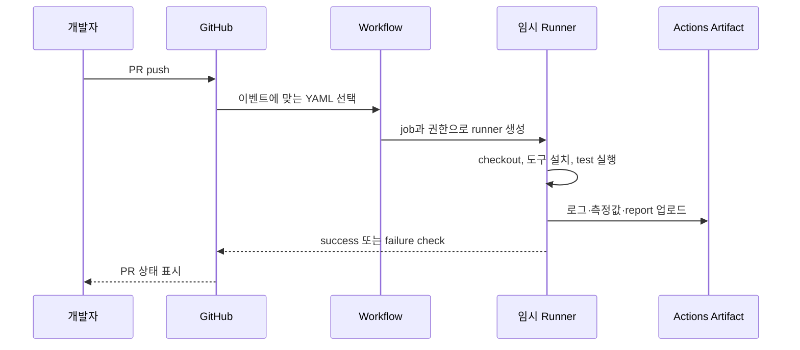

# 느린 CI를 마주했을 때: GitHub Actions, 테스트, 배포가 실제로 움직이는 방식

> 이 글은 OnMaru-backend의 현재 직렬 CI를 출발점으로, CI·CD·테스트가 서로 무엇이 다르고 GitHub Actions runner 안에서 어떤 프로세스로 실행되는지 설명하는 첫 번째 글입니다. 코드 파일을 열어 본 적 없는 독자도 따라올 수 있도록 시작해 보겠습니다.

## “CI가 느리다”는 말에는 여러 시간이 섞여 있습니다

PR을 올리고 초록색 체크 표시를 기다릴 때 우리는 흔히 “CI가 느리다”고 말합니다. 그런데 그 기다림에는 서로 다른 세 가지 일이 한 줄처럼 섞여 있습니다. 테스트는 코드가 기대한 대로 동작하는지 확인하는 실행이고, CI(Continuous Integration)는 여러 사람이 바꾼 코드를 합치기 전에 빌드·테스트·정적 검사를 자동으로 묶어 실행하는 절차입니다. CD(Continuous Delivery 또는 Deployment)는 CI를 통과한 결과물을 staging 또는 production에 전달하고, 실제 서비스가 살아 있는지 확인하는 배포 절차입니다.

OnMaru-backend는 Spring/Gradle 모듈과 Python/FastAPI 검사가 함께 있는 백엔드입니다. 그래서 CI는 단순히 Java 테스트 하나를 돌리는 버튼이 아닙니다. 관광 API, 카탈로그, 오디오, 커뮤니티 같은 Gradle module test와 Spring API test, Node 기반 계약 검증, Python/FastAPI 검사, AI 평가가 함께 있어야 “이 변경을 합쳐도 되는가”라는 질문에 답할 수 있습니다. 반면 CD는 이 답을 받은 뒤 image를 만들고 배포하며 health check를 통과했는지 확인하는 다음 단계입니다.

| 이름 | 독자가 얻는 답 | OnMaru-backend의 예 | 실패했을 때의 의미 |
| --- | --- | --- | --- |
| 테스트 | 이 기능·모듈이 기대대로 동작하는가 | `./gradlew :modules:catalog:test` | 코드 또는 테스트 환경 문제 |
| CI | 이 변경을 다른 코드와 합쳐도 안전한가 | `verify` job의 전체 검사 | 병합 전 중단 신호 |
| CD | 검증된 결과가 실제 환경에서도 준비됐는가 | image, staging deploy, health check | 배포·환경·운영 문제 |

이 셋을 구분해야 속도 개선도 정직해집니다. 테스트 명령 하나를 건너뛰면 CI 시간은 짧아지지만 안전성은 낮아집니다. CI를 통과했다고 CD 시간이 자동으로 짧아지는 것도 아닙니다. 이번 Toolkit의 목표는 테스트 범위를 빼지 않은 상태에서 **CI의 기다리는 시간**을 줄이고, 그 전후를 수치로 남기는 것입니다.

## GitHub Actions는 Git 이벤트를 임시 컴퓨터의 작업으로 바꿉니다

GitHub Actions는 GitHub 안에서 계속 실행되는 서버가 아닙니다. `pull_request`, `push`, `workflow_dispatch` 같은 이벤트가 발생하면 GitHub가 workflow YAML을 읽고, 각 job을 실행할 임시 runner를 배정하는 자동화 시스템입니다. GitHub-hosted runner라면 보통 새 Ubuntu 가상 환경이 준비되고, job이 끝나면 그 파일 시스템은 사라집니다. 그래서 이전 실행의 Gradle daemon, 환경 변수, 임시 파일을 다음 실행이 믿어서는 안 됩니다.



*PR의 초록색 체크 하나는, 실제로는 임시 runner에서 실행된 프로세스와 artifact의 결과를 GitHub가 요약한 상태입니다.*

workflow는 설계도, job은 독립적인 작업실, step은 작업실에서 순서대로 실행되는 shell 명령이라고 보면 이해가 쉽습니다. 같은 job 안의 step은 기본적으로 앞 step이 끝난 뒤 다음 step이 시작합니다. 서로 다른 job은 `needs` 의존성이 없다면 동시에 실행될 수 있습니다. 이 “job 경계”가 나중에 병렬화의 가장 중요한 단위가 됩니다.

runner는 결국 Linux 프로세스를 실행합니다. `actions/checkout`이 Git object를 내려받아 workspace에 파일을 만들고, `setup-java`가 JDK를 PATH에 연결하고, `./gradlew`가 JVM 프로세스를 시작합니다. JVM은 Gradle task를 구성하고 test worker JVM을 띄우며, Python 검사는 별도 Python interpreter process에서 실행됩니다. 한 runner 안에 순서대로 넣으면 CPU 코어가 놀고 있어도 다음 test process는 앞선 process가 종료될 때까지 기다립니다. 이것이 “직렬 CI”의 물리적인 모습입니다.

## 현재 OnMaru-backend가 느린 이유는 검사량보다 대기 구조에 있습니다

현재 required check로 운영 중인 것은 직렬 `verify`입니다. `verify` 안에서는 여러 module test와 품질 검사가 한 runner에서 순서대로 실행됩니다. 각 테스트가 필요한 것은 맞지만, 서로 독립적인 catalog와 community test까지 앞 작업을 기다리는 구조라면 전체 완료 시간은 각 단계 시간의 합에 가까워집니다.

```text
TourAPI → Insights → Catalog → Audio → Community → Identity
→ Journey → Operations → Spring API → contract/Python/AI 검사
```

동일한 OnMaru-backend commit SHA에서 직렬 `verify`를 세 번 실행한 관측값은 413초, 361초, 400초였고 중앙값은 400초, 즉 약 6분 40초였습니다. 한 번의 실행이 아니라 세 번을 쓴 이유는 runner가 새로 만들어지는 시간, 의존성 다운로드, 네트워크 상태, cache 상태가 매번 조금씩 다르기 때문입니다. 361초인 한 번만 들고 와서 “원래 6분”이라고 말하면, 다음날 413초가 나온 순간 비교가 무너집니다.

특히 세 번째 표본에서 Spring API test는 약 209초를 차지했습니다. 이것은 병렬화를 해도 없어지지 않는 긴 작업입니다. 병렬화는 모든 시간을 0으로 만드는 마법이 아니라, 서로 기다릴 이유가 없는 시간을 겹치게 만드는 작업입니다. 따라서 최종 시간은 대체로 가장 긴 lane, runner 준비 시간, artifact 업로드 같은 공통 비용의 합으로 수렴합니다.

## 병렬화는 CPU 하나를 더 빠르게 만드는 일이 아니라 기다림을 겹치는 일입니다

직렬 실행은 한 사람이 검사 목록을 순서대로 읽는 모습과 비슷합니다. 병렬 실행은 서로 독립적인 검사 항목을 여러 검사원에게 나누되, 마지막에는 한 명이 모든 결과를 모아야 하는 구조입니다. 운영체제 관점에서는 서로 다른 job이 서로 다른 runner VM에서 실행되므로 address space, process table, 작업 디렉터리가 분리됩니다. Gradle cache나 test fixture를 함부로 공유하지 않는 이유도 이 격리 경계를 깨면 재현성이 무너질 수 있기 때문입니다.

하지만 무제한 병렬화는 좋은 답이 아닙니다. 열두 module을 동시에 띄우면 GitHub Actions 비용이 커지고, 외부 API·공유 테스트 DB·artifact upload가 한꺼번에 몰릴 수 있습니다. OnMaru-backend의 목표 설정인 `max_parallel: 4`는 최대 네 작업을 동시에 열고, 나머지는 runner가 비는 순서대로 실행하게 하는 상한입니다. 이 상한은 더 빠른 숫자와 안정적인 실행 사이의 운영 정책입니다.

## CI가 끝난 뒤에야 CD가 시작합니다

CI가 성공했다는 사실은 source code가 현재 검증 규칙을 통과했다는 뜻입니다. CD에서는 그 commit을 식별할 수 있는 image를 만들고, image digest가 기대한 값과 같은지 확인하고, staging에 배포한 뒤 readiness 또는 health endpoint를 확인합니다. 여기서 image build cache, registry 전송, Kubernetes scheduler, database migration, 외부 의존성은 CI test 시간과 전혀 다른 병목을 가질 수 있습니다.

그래서 앞으로의 보고서는 “CI가 20% 빨라졌다”와 “배포 리드타임이 20% 빨라졌다”를 같은 숫자로 말하지 않습니다. CI는 `verify` wall-clock과 module critical path로, CD는 build 시작부터 deploy와 health check 성공까지의 lead time으로 따로 기록합니다. 이것이 두 번째와 세 번째 글에서 설명할 evidence 설계의 출발점입니다.

## 첫 번째 글을 마치며

지금까지의 결론은 단순합니다. OnMaru-backend의 현재 검증은 필요한 일을 하고 있지만 한 runner 안에서 직렬로 기다리는 시간이 큽니다. GitHub Actions는 event를 임시 runner의 process 실행으로 바꾸고, 우리는 job 경계를 이용해 독립적인 테스트를 병렬화할 수 있습니다. 다만 CI, 테스트, CD는 다른 질문에 답하므로, 다음 글에서는 이 병렬 설계를 왜 backend 코드 안의 라이브러리로 넣지 않고 별도 Toolkit repository의 reusable workflow로 만들었는지 살펴보겠습니다.
