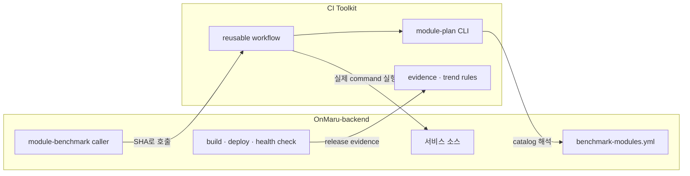

# 코드에 import하지 않는 CI 플랫폼: 두 저장소와 reusable workflow를 연결하는 설계

> 첫 번째 글에서 CI가 임시 runner 위의 process 실행이라는 사실을 보았습니다. 이 글은 그 runner가 OnMaru-backend와 CI Toolkit을 어떻게 함께 사용하며, 왜 애플리케이션 의존성 대신 GitHub Actions reusable workflow라는 연결 방식을 선택했는지 다룹니다.

## 문제는 테스트 코드를 재사용하는 것이 아니라 검증 규칙을 재사용하는 데 있습니다

처음에는 “병렬화 도구를 OnMaru-backend에 Python library로 설치하면 되지 않을까?”라는 생각을 하기 쉽습니다. library는 코드에서 함수처럼 호출하기 편하고 version도 package manager로 관리할 수 있으니까요. 그런데 이 문제의 주인공은 서비스 요청을 처리하는 application runtime이 아니라, PR이 열릴 때만 잠깐 살아나는 CI runner입니다. 서비스 JVM이나 FastAPI process가 module matrix를 계산할 이유는 없고, 오히려 운영 서비스의 dependency graph에 CI 도구를 넣으면 배포 artifact와 보안 범위만 넓어집니다.

그래서 역할을 나눴습니다. **서비스 소스와 배포 자격 증명은 OnMaru-backend가 소유합니다.** Gradle/Python test command, module dependency, runner 정책도 같은 경계 안에 있습니다. OnMaru-backend-ci-toolkit은 catalog를 해석하는 CLI, reusable workflow, evidence schema, 비교와 보고서 규칙을 소유합니다. 두 저장소는 package import가 아니라 GitHub Actions의 `uses:` 선언으로 연결됩니다.



*Toolkit은 테스트의 판단 방법을 제공하고, OnMaru-backend는 자기 코드와 자기 권한으로 테스트와 배포를 실행합니다.*

이 경계는 조금 돌아가는 구조처럼 보이지만 장점이 큽니다. catalog가 늘어나거나 새로운 consumer repository가 생겨도 application source를 복사하지 않아도 됩니다. 반대로 Toolkit의 report formatter를 고쳐도 서비스 API binary를 다시 빌드하거나 배포할 필요가 없습니다. CI 도구의 release와 서비스 release가 독립적으로 움직일 수 있다는 뜻입니다.

## reusable workflow는 원격 코드를 신뢰된 runner에서 실행하는 계약입니다

GitHub Actions의 reusable workflow는 다른 repository의 workflow YAML을 job처럼 호출하는 기능입니다. caller인 OnMaru-backend workflow가 다음처럼 선언하면 GitHub는 지정한 ref에서 Toolkit workflow definition을 읽어 실행 그래프를 구성합니다.

```yaml
jobs:
  module-benchmark:
    uses: YRootLab/OnMaru-backend-ci-toolkit/.github/workflows/module-benchmark.yml@<immutable-toolkit-commit>
    with:
      catalog_path: .github/benchmark-modules.yml
      toolkit_ref: <same-immutable-toolkit-commit>
      mode: pr
      max_parallel: 4
```

여기에는 두 번의 참조가 있습니다. `uses: ...@<commit>`은 GitHub가 어떤 workflow definition을 읽을지 결정합니다. `toolkit_ref`는 reusable workflow 내부가 Toolkit source를 `.pipeline-toolkit` directory로 checkout할 때 어떤 code revision을 가져올지 결정합니다. 둘이 다르면 YAML은 옛날 규칙으로 실행하면서 CLI는 새 규칙을 실행하는 이상한 혼합 상태가 될 수 있습니다. 따라서 설계는 두 값이 같은 immutable commit이어야 한다고 강제합니다.

reusable workflow가 호출되었다고 OnMaru-backend의 source가 Toolkit repository로 전송되는 것은 아닙니다. GitHub가 caller context의 runner에서 backend를 checkout하고, 같은 runner에 Toolkit을 별도 directory로 checkout합니다. module test는 backend workspace에서 실행되고 artifact도 caller인 OnMaru-backend Actions run에 업로드됩니다. Toolkit은 runner가 종료될 때 함께 사라지는 실행 규칙일 뿐입니다.

## 40자리 commit SHA는 SHA-256이 아니라 현재 Git의 SHA-1 object ID입니다

여기서 자주 생기는 혼동을 정확히 짚고 가는 편이 좋겠습니다. 현재 GitHub repository에서 흔히 보이는 **40자리 16진수 commit SHA는 일반적으로 SHA-1 기반 Git object ID**입니다. SHA-1은 160 bit이고, 4 bit를 16진수 한 자리로 표현하므로 40자리가 됩니다. 반대로 SHA-256 digest의 전체 길이는 256 bit, 즉 64자리 16진수입니다. 따라서 `0f6049...`처럼 40자리로 workflow를 고정하는 일을 “SHA-256 40자리 hash”라고 부르면 기술적으로는 맞지 않습니다.

그렇다고 이 설계가 SHA-1 하나의 암호학적 강도만 믿는다는 뜻도 아닙니다. 여기서 SHA는 “변하지 않는 revision을 정확히 가리키는 주소”로 쓰입니다. branch 이름인 `develop`은 내일 다른 commit을 가리킬 수 있고, mutable tag도 사람이 다시 옮길 수 있습니다. 반면 승인한 commit object ID는 같은 repository history 안에서 특정 tree와 parent, author·message metadata를 가리킵니다. GitHub의 protected branch, PR review, release process, repository access control과 함께 사용해야 공급망 신뢰가 완성됩니다.

| 참조 방식 | 내일 같은 코드를 가리키는가 | 이 설계에서의 사용 |
| --- | --- | --- |
| `@develop` | 아니요. 새 merge마다 바뀜 | 금지 |
| `@v0.1.1` tag | tag 보호 정책에 따라 달라짐 | 사람이 읽는 release 이름으로는 유용 |
| `@40자리 commit SHA` | 예. 해당 Git object를 정확히 가리킴 | workflow 실행 pin |
| caller의 `github.workflow_sha` | OnMaru-backend commit임 | Toolkit ref로 사용 금지 |

현재 Toolkit release `v0.1.1`의 target commit은 `0f6049a59add9e97dff3d37671ee524c8f3b6ce8`입니다. 이 SHA를 예시로 쓰는 이유는 “가장 최신이라서”가 아니라 “검증한 Toolkit release를 고정해서 어떤 PR이 어떤 실행 규칙을 사용했는지 나중에도 재현할 수 있기 때문입니다.” 새 release를 채택할 때는 workflow ref와 `toolkit_ref`를 함께 바꾸는 PR을 만들고 검증하면 됩니다.

## catalog는 서비스에 가장 가까운 사람이 유지하는 실행 계약입니다

Toolkit은 `catalog`라는 이름의 module이 실제로 어느 Gradle path에 있는지 알지 못합니다. 이 지식은 OnMaru-backend가 소유해야 합니다. `.github/benchmark-modules.yml`에는 module ID, 파일 경로 pattern, 실제 command, 의존 관계, resource profile이 들어갑니다.

```yaml
id: catalog
paths: ["modules/catalog/**"]
depends_on: []
test_command: "./gradlew :modules:catalog:test --no-daemon"
resource_profile: medium
```

`depends_on`은 코드의 의존 방향을 표현합니다. 예를 들어 audio가 catalog에 의존한다면 catalog가 바뀌었을 때 audio도 위험해질 수 있습니다. Planner는 직접 변경된 module만 고르는 데서 멈추지 않고 역방향 그래프를 따라 consumer module도 고릅니다. 이 과정은 그래프 탐색 문제이며, cycle이 있는 catalog는 실행 전에 거절합니다. CI가 애매한 dependency graph를 임의로 해석하는 것보다, 잘못된 catalog를 빠르게 실패시키는 편이 안전하기 때문입니다.

공통 Gradle 설정, workflow 파일, 모듈로 분류되지 않는 경로는 더욱 조심해야 합니다. 이 경우 “아무 module도 선택되지 않았으니 테스트를 생략한다”는 것은 대참사에 가깝습니다. Toolkit planner는 `always_full_paths`와 unknown-path fallback을 통해 전체 suite를 선택합니다. 빠른 PR만 최적화하고 불확실한 변경은 보수적으로 검사하는 것이 selective testing의 기본 태도입니다.

## 최소 권한은 기능 제약이 아니라 설계의 일부입니다

CI가 source를 읽고 test를 실행한다고 해서 PR comment 작성, release 생성, deployment 실행 권한까지 필요하지는 않습니다. reusable module workflow는 기본적으로 `contents: read`만 사용하고, fork PR에 secret을 넘기지 않으며, `persist-credentials: false` checkout을 사용합니다. backend의 deployment credential과 Toolkit의 planner 권한을 분리하면, untrusted PR의 shell command가 가진 영향 범위도 좁아집니다.

이 경계에는 trade-off도 있습니다. Toolkit이 backend에 write 권한을 갖지 않으므로 자동으로 PR을 수정하거나 production promotion을 결정할 수 없습니다. 일부 사람에게는 답답해 보일 수 있지만, CI 결과가 잘못 계산됐을 때 서비스 환경까지 곧바로 바뀌는 위험을 막아 줍니다. 결과를 읽기 쉬운 report와 recommendation으로 만들고, 배포·승인은 OnMaru-backend의 보호된 정책에서 결정하는 편이 장기적으로 더 설명 가능한 자동화가 됩니다.

## 두 번째 글을 마치며

두 저장소를 나눈 핵심 이유는 재사용성과 권한 경계입니다. Toolkit은 workflow와 planner를 version-pinned contract로 제공하고, OnMaru-backend는 실제 source·command·secrets·deployment를 계속 소유합니다. 다음 글에서는 이 contract가 runner에서 matrix job으로 펼쳐지는 과정, 왜 처음에는 shadow check를 해야 하는지, 그리고 400초 기준선을 어떻게 병렬 실행과 공정하게 비교하는지 살펴보겠습니다.
