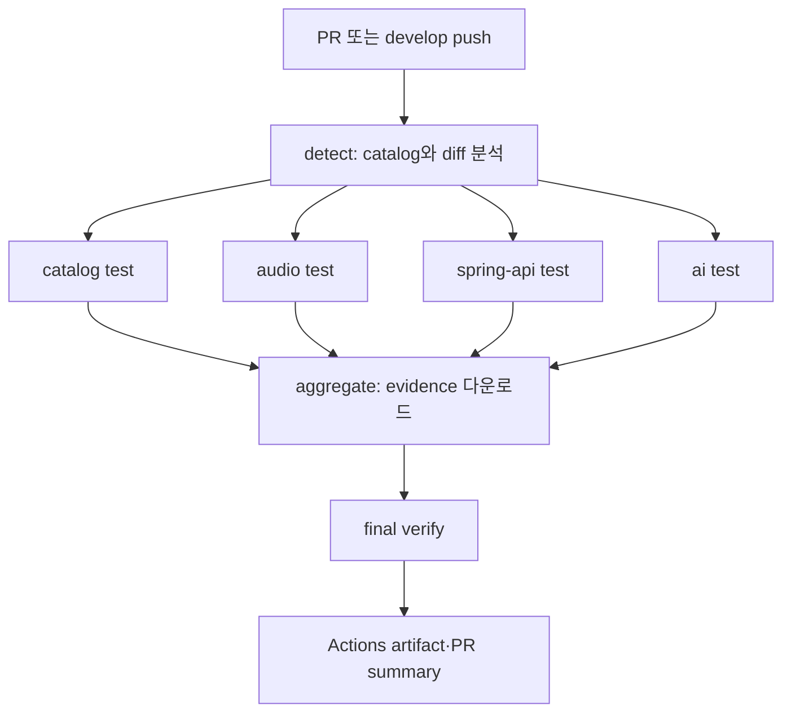
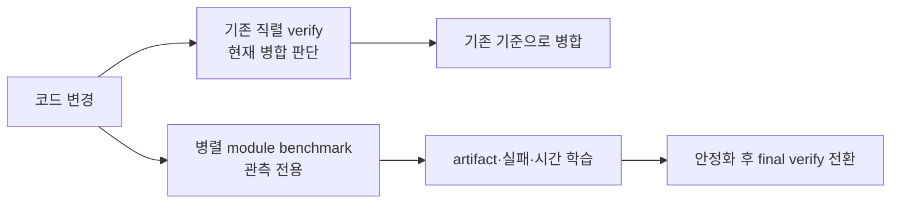

# 병렬 CI를 성과로 바꾸는 법: fan-out, shadow check, evidence, 그리고 CD까지

> 앞의 두 글에서 GitHub Actions runner와 두 repository의 경계를 이해했다면, 이제 가장 중요한 질문이 남습니다. “그래서 실제로 어떻게 병렬로 바꾸고, 무엇을 근거로 빨라졌다고 말할 수 있을까?” 이 글은 현재 OnMaru-backend의 상태와 목표 rollout을 구분해 설명합니다.

## 병렬화는 한 번의 YAML 수정으로 끝나는 작업이 아닙니다

현재 required check는 직렬 `verify`입니다. 이 사실은 중요합니다. Toolkit reusable workflow와 caller 설계는 준비됐지만, 모든 PR이 이미 module matrix만으로 통과하는 상태는 아닙니다. 따라서 **아직 공식 개선률을 선언하지 않는다.** PR #374는 오래된 caller 구현이며 `develop`과 충돌하고 과거 AI runtime 실패 run도 갖고 있습니다. 그래서 이를 그대로 merge하지 않고, 최신 `develop`에서 대체 caller PR을 만들고 실제 Actions run으로 재검증하는 것이 rollout의 출발점입니다.

병렬화에는 두 가지 성공이 필요합니다. 첫째, 모든 필요한 테스트가 빠짐없이 실행되고 실패가 숨겨지지 않는 **정확성**입니다. 둘째, 같은 조건에서 직렬보다 기다리는 시간이 실제로 줄어드는 **성능**입니다. 첫 번째만 확인된 상태에서 “40% 개선”이라고 말하면 위험하고, 두 번째만 보고 테스트 누락을 허용하면 더 위험합니다. shadow check는 이 두 성공을 분리해 확인하기 위한 안전 장치입니다.

## fan-out과 fan-in은 분산 작업의 시작과 합류를 뜻합니다

fan-out은 하나의 계획을 여러 독립 job으로 펼치는 일입니다. planner가 module 목록을 JSON matrix로 만들면 GitHub Actions scheduler는 module마다 runner job을 만들고 최대 네 개를 동시에 시작합니다. fan-in은 흩어진 job의 결과와 artifact를 다시 한 곳으로 모아 단 하나의 결론을 만드는 일입니다.



*fan-out은 독립 테스트를 동시에 시작하고, fan-in은 결과가 하나라도 빠지지 않았는지 확인해 하나의 CI 결론으로 되돌립니다.*

OnMaru-backend catalog에는 tourism-api, persistence-jdbc, catalog, audio, community, identity, insights, journey, operations, shared-web, spring-api, ai처럼 여러 module이 정의돼 있습니다. PR mode에서는 Git diff가 선택 입력이고, develop mode에서는 diff가 없으므로 planner가 안전하게 full suite를 선택합니다. 따라서 PR은 변경 영향 범위로 빠른 피드백을 주고, develop은 전체 모듈을 반복 실행해 누적 evidence를 쌓는다는 역할 분리가 가능합니다.

GitHub Actions matrix의 `max-parallel: 4`는 scheduler에게 동시에 네 module job까지만 시작하라고 지시합니다. `fail-fast: false`는 module 하나가 실패해도 나머지 module을 취소하지 않아 진단 evidence를 남기게 합니다. module별 concurrency group은 같은 repository의 같은 module job이 동시에 자원을 건드리는 일을 줄이고, `cancel-in-progress: false`는 이미 시작된 관측 job을 새 PR 때문에 함부로 버리지 않도록 합니다. 이 선택은 가장 빠른 feedback보다 재현 가능한 evidence를 조금 더 우선한 정책입니다.

## module job은 독립 Linux process와 artifact를 만듭니다

matrix의 각 항목은 별도 runner에서 consumer repository를 checkout한 뒤, catalog가 준 shell command를 `bash -lc`로 실행합니다. 예를 들어 catalog test라면 Gradle wrapper가 JVM을 시작하고 test worker JVM을 띄우며, AI test라면 Python interpreter와 `uv` 환경이 실행됩니다. 각 runner의 root filesystem, process namespace, working directory는 독립적이므로 한 module의 Gradle daemon이나 환경 변수가 다른 module에 암묵적으로 의존해서는 안 됩니다.

Toolkit workflow는 command의 stdout·stderr를 파일로 잡고 `/usr/bin/time -v`의 원본 기록과 종료 코드, wall-clock 시간을 module artifact로 올립니다. runner에서 upload된 artifact는 job 종료 뒤에도 OnMaru-backend Actions run에 보존되므로, PR 화면의 초록색 체크만 보고 지나가는 대신 나중에 “어느 module이 오래 걸렸고 어떤 command가 실패했는지”를 다시 확인할 수 있습니다.

여기에는 미묘한 측정 경계가 있습니다. `/usr/bin/time -v` 원본 출력은 Linux process의 user/system CPU time이나 maximum resident set size 같은 힌트를 줄 수 있습니다. 하지만 현재 표준 module manifest가 공식 비교에 쓰는 값은 주로 wall-clock입니다. 반면 직렬 CI collector는 GitHub Actions API의 시작·종료 시각을 읽는데, 그 API만으로는 CPU·메모리(RSS)를 얻을 수 없습니다. 두 경로의 자원 수치를 같은 지표로 비교하려면 parser·schema·환경 식별을 추가해야 하므로, 수집하지 못한 값은 `null` 또는 `unavailable`로 남기고 0으로 기록하지 않습니다.

## aggregate가 만드는 critical path와 전체 CI 시간은 다릅니다

module job이 끝나면 aggregate job이 `module-evidence-*` artifact를 전부 내려받아 manifest와 report를 만듭니다. 현재 workflow가 계산하는 `critical_path_seconds`는 관측된 module 실행 시간 중 가장 큰 값입니다. 예를 들어 catalog가 50초, audio가 70초, spring-api가 220초라면 module critical path 후보는 220초입니다.

그러나 사용자가 실제로 기다리는 PR wall-clock은 220초와 반드시 같지 않습니다. detect job, matrix queue, 네 개씩 실행한 wave의 대기, artifact upload/download, aggregate, final verify 시간도 있기 때문입니다. 정확한 성과 보고서는 “가장 긴 module test가 줄었는가”와 “PR check 전체가 몇 초 만에 끝났는가”를 별도 그래프로 보여야 합니다. 이 구분이 없으면 긴 module 하나를 고쳤는데 runner queue가 늘어난 상황을 놓칠 수 있습니다.

현재 aggregate는 모든 module이 성공해도 비교 기준이 없으면 `inconclusive`를 반환합니다. 이는 실패가 아니라 아직 성능 판정을 하지 않았다는 뜻입니다. `verify`는 `failed`를 실패로 처리하고 `inconclusive`를 관측 성공으로 통과시킵니다. shadow 단계에는 합리적이지만, 향후 branch protection에 성능 gate를 넣으려면 #366의 durable evidence와 비교 정책이 준비된 뒤에야 합니다.

## shadow check는 새 브레이크를 시험하는 기간입니다

새 병렬 workflow를 바로 required check로 만들면, catalog 오기입, runtime 누락, artifact naming 오류, fork PR 권한 차이 같은 문제 하나가 모든 개발자의 병합을 막을 수 있습니다. 반대로 기존 직렬 `verify`를 없애면 병렬 catalog가 놓친 module을 테스트하지 못할 수 있습니다. shadow check는 기존 안전장치를 유지한 채 새 안전장치를 나란히 붙이는 방식입니다.



*shadow 단계에서는 속도보다 누락 없는 실행과 재현 가능한 evidence를 먼저 증명합니다.*

shadow 기간에는 docs-only 변경, 공통 Gradle 설정 변경, 직접 module 변경, 알 수 없는 경로 변경을 모두 시험해야 합니다. 어떤 경우에 선택 실행을 하고 어떤 경우에 full suite fallback을 하는지 fixture test로 고정해야 합니다. AI module은 fresh runner에서 `uv`가 없었던 실패가 실제로 있었고 #379에서 bootstrap을 고쳤습니다. 이런 종류의 문제는 application logic가 아니라 CI runtime contract가 빠진 경우이므로, shadow run이 존재해야 안전하게 발견됩니다.

## 기준선은 빠른 한 번이 아니라 비교 가능한 반복입니다

현재 직렬 `verify`의 동일 commit SHA 표본은 413초, 361초, 400초이고 중앙값은 400초입니다. 이 400초는 “언제나 정확히 400초”라는 약속이 아니라, runner 변동을 줄인 현재의 비교 기준입니다. 병렬 구조도 같은 commit SHA, runner image·architecture, Java/Python version, dependency mode, cache policy, test command 조건에서 세 번 이상 성공해야 중앙값을 비교할 수 있습니다.

```text
개선율 = (직렬 중앙값 - 병렬 중앙값) / 직렬 중앙값 × 100
```

예를 들어 병렬 중앙값이 280초라면 산술상 약 30%의 wall-clock 감소입니다. 하지만 병렬 run 중 artifact가 빠졌거나 테스트 하나가 실패했거나 cache가 한쪽만 warm이었다면 이 계산을 발표하면 안 됩니다. 이 경우 결과는 `inconclusive`입니다. 빠른 실패는 빠른 성공이 아니고, 다른 환경의 숫자는 개선률이 아니라 다른 실험 결과일 뿐입니다.

현재 #368의 과제는 이 직렬 세 표본을 `ci-serial-baseline` immutable artifact로 완성하는 일입니다. collector workflow가 기본 브랜치에서도 dispatch 가능해야 과거 run ID를 넣어 보존 가능한 manifest를 발행할 수 있습니다. raw benchmark data나 consumer source를 Toolkit repository에 commit하지 않고, evidence URI와 정규화한 사실만 비교에 사용합니다.

## final verify는 중복 실행 없이 안전성을 되찾아야 합니다

병렬 evidence가 충분히 쌓이면 #364에서 직렬 `verify`를 final fan-in check로 전환합니다. 여기서 가장 피해야 할 것은 같은 Gradle module test를 기존 serial job과 Toolkit matrix가 동시에 실행하는 구조입니다. 처음 shadow 기간에는 의도적인 중복이지만, 최종 구조에서는 비용만 두 배가 되고 PR은 느려집니다.

역할은 명시적으로 나눕니다. Toolkit matrix는 변경 영향 기반 Gradle/Python module test와 module evidence를 담당합니다. native CI lane은 repository hygiene, public contract, generated artifact처럼 catalog module test로 표현되지 않는 검사를 담당합니다. final `verify`는 이 두 종류의 결과와 artifact 완전성을 fan-in으로 확인합니다. child job이 실패·취소되거나 필수 artifact가 없으면 final `verify`도 실패해야 합니다.

이름을 `verify`로 유지하는 것도 운영상 의미가 있습니다. branch protection과 개발자는 이미 `verify`라는 최종 신호를 알고 있습니다. 내부 topology는 직렬에서 병렬로 바꾸되, “무엇이 병합을 허용하는가”라는 인터페이스를 불필요하게 바꾸지 않으면 rollout의 위험을 줄일 수 있습니다.

## CI의 개선 기록은 release와 CD의 기록으로 이어집니다

PR은 개발자가 기다리는 시간이 중요하므로 영향받은 module을 빠르게 검사하는 곳입니다. `develop`과 nightly는 full suite를 반복해 흔들림을 관찰하는 곳입니다. release는 tag, commit SHA, image digest, configuration hash, runner profile을 남기고 이전 release와 비교하는 곳입니다. CD는 build 시작부터 staging deploy와 health check 성공까지의 시간과 실패 원인을 기록하는 곳입니다.

Toolkit의 release trend workflow는 deployment를 대신하지 않습니다. OnMaru-backend가 image build와 deploy, protected environment approval, rollback을 계속 소유합니다. Toolkit은 caller가 제공한 candidate manifest와 이전 release manifest를 읽어 `trend compare` 결과를 artifact로 남깁니다. 이 분리는 benchmark가 실패했을 때 production이 자동으로 바뀌지 않게 하고, 실제 배포 권한을 서비스 운영 정책 안에 머물게 합니다.

## 세 편의 이야기를 다시 하나로 묶어 보면

처음에는 “CI가 느리다”는 한 문장에서 출발했습니다. 실제로는 GitHub Actions가 event를 임시 Linux runner의 process 실행으로 바꾸고, OnMaru-backend가 실제 test와 deployment를 소유하며, Toolkit이 안전한 실행 계획과 evidence 해석을 제공하는 구조였습니다. 두 repository를 reusable workflow와 immutable commit pin으로 연결했기 때문에 application runtime dependency를 늘리지 않으면서도 실행 규칙을 재사용할 수 있습니다.

그리고 병렬화는 단지 matrix YAML을 추가하는 일이 아닙니다. shadow check에서 실제 runner의 계약을 검증하고, fan-out으로 독립 테스트를 펼치고, fan-in으로 누락 없는 결과를 만들고, 같은 조건의 반복 표본으로 400초 기준선과 비교하고, 마지막에는 release와 CD까지 같은 evidence 문법으로 연결하는 일입니다. 이 과정을 따라가면 “빨라 보이는 CI”가 아니라, 왜 빨라졌고 언제 다시 느려졌는지 설명할 수 있는 CI를 만들 수 있다고 생각합니다.
