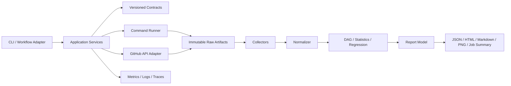

# OnMaru Pipeline Toolkit 객관적 진단 보고서

평가일: 2026-09-23
대상: `develop`
평가 관점: Backend Architecture, Observability Architecture, Observability Engineering, DevOps Engineering

## 1. Executive Summary

### 종합 점수: 73 / 100

현재 저장소는 **테스트 가능한 benchmark/evidence core**로서는 좋은 수준이다. 특히 versioned contract, command failure classification, DAG timing, repeated comparison, deterministic report, workflow security policy가 작은 모듈과 fixture로 나뉘어 있고, `develop` 기준 테스트 38개가 통과한다.

그러나 **운영 가능한 관측성·배포 플랫폼**이라고 부르기에는 아직 중요한 공백이 있다. 실제 OpenTelemetry/Prometheus/Grafana/Loki/Alertmanager 파이프라인, structured telemetry correlation, CLI/package distribution, dependency lock, coverage/security supply-chain gate, Docker/runtime packaging, 실제 branch protection 적용 증거가 없다.

따라서 현재 판정은 다음과 같다.

| 판정 | 결과 |
|---|---|
| Prototype / foundation | 통과 |
| Team-internal beta | 조건부 통과 |
| Production-ready platform | 보류 |
| 가장 큰 강점 | evidence lifecycle과 실패 상태를 테스트 가능한 core로 만든 점 |
| 가장 큰 약점 | 관측성 운영 계층과 실제 delivery hardening이 구현되지 않은 점 |

## 2. 평가 범위와 evidence

### 확인한 사실

| Evidence | 관찰 결과 | 해석 |
|---|---:|---|
| Python tests | 38 passed | 현재 구현의 fixture/unit regression 신뢰도는 양호 |
| `src/pipeline_toolkit` statements | 532 | 작은 modular monolith로 구조가 이해 가능 |
| 로컬 source coverage | 92% | 테스트 밀도는 높지만 CI에서 coverage threshold를 강제하지 않음 |
| GitHub workflow files | 3개 | CI, reusable benchmark, release automation의 기본 골격 존재 |
| CI workflow | 성공 | 기본 verification path는 동작 |
| reusable workflow push runs | 반복 실패 | `workflow_call` 전용 workflow를 직접 push에서 실행하려는 운영 불일치 존재 |
| GitHub ruleset file | active ruleset 파일 존재 | 선언적 정책은 있음 |
| REST branch protection | 404 | 실제 branch protection 적용은 별도 확인/보완 필요 |
| Dockerfile / compose | 확인되지 않음 | toolkit 실행 이미지·재현 가능한 runtime packaging 부족 |
| CLI entrypoint | 확인되지 않음 | consumer가 표준 명령으로 사용하기 어려움 |
| OTel/Prometheus/Grafana/Loki/Alertmanager | 구현 파일 확인되지 않음 | observability는 evidence metadata 중심이며 운영 telemetry는 미구현 |

평가에서 “확인되지 않음”은 “절대 존재하지 않는다”는 뜻이 아니라, 현재 repository와 workflow에서 검증 가능한 구현·fixture·설정으로 확인되지 않았다는 뜻이다.

## 3. 100점 종합 점수표

| 평가 영역 | 배점 | 점수 | 비율 | 판정 |
|---|---:|---:|---:|---|
| Backend architecture & modularity | 20 | 15 | 75% | 양호 |
| Evidence/data model correctness | 20 | 15 | 75% | 양호 |
| Observability architecture & engineering | 15 | 6 | 40% | 보완 필요 |
| DevOps/CI/CD delivery | 20 | 12 | 60% | 보완 필요 |
| Security & execution reliability | 15 | 12 | 80% | 양호 |
| Testing & verification quality | 10 | 9 | 90% | 강점 |
| Documentation & governance | 5 | 4 | 80% | 양호 |
| **합계** | **100** | **73** | **73%** | **조건부 beta** |

### 점수 해석

| 점수 구간 | 의미 |
|---:|---|
| 90–100 | production platform: 운영 증거와 자동화 gate까지 완성 |
| 80–89 | production candidate: 제한된 운영 도입 가능 |
| 70–79 | team-internal beta: 핵심 기능은 있으나 운영 hardening 필요 |
| 60–69 | functional prototype: 기능 증명 중심 |
| 0–59 | design/experiment 단계 |

## 4. 관점별 상세 평가

### 4.1 Backend Architecture — 15 / 20

#### 잘한 부분

| 항목 | 평가 |
|---|---|
| 모듈 경계 | `contracts`, `runners`, `collectors`, `compare`, `pipeline`, `reports`, `provenance`, `security`가 목적별로 분리되어 있다. |
| Modular monolith 선택 | 현재 규모와 불명확한 plugin boundary에는 microservices보다 적절하다. |
| 외부 도구 adapter 방향 | JUnit, pytest, Gradle, Docker 결과를 공통 `Evidence`로 수렴시키는 방향이 합리적이다. |
| 실패 상태 모델 | success/failed/timeout/partial/missing/invalid/inconclusive를 구분한다. |
| deterministic output | report ordering, pagination, PNG output을 반복 가능하게 만들었다. |

#### 부족한 부분

| gap | 영향 | 우선순위 |
|---|---|---|
| 명시적 normalize/application service 계층 부족 | collector와 report/analyzer가 가까워질 위험 | P1 |
| public CLI/API 없음 | consumer adoption이 Python import 중심으로 남음 | P0 |
| plugin/capability registry 없음 | collector 추가 시 중앙 import와 조건 분기가 늘어남 | P1 |
| GitHub API client가 pagination/rate-limit abstraction으로 완성되지 않음 | 실제 Actions 규모에서 reliability 불확실 | P0 |
| schema model과 JSON schema의 중복 | dataclass와 schema drift 가능성 | P1 |

#### 권고 구조



### 4.2 Evidence/Data Model — 15 / 20

#### 잘한 부분

- release tag보다 commit SHA와 image digest를 immutable identity로 보려는 방향이 좋다.
- raw artifact checksum manifest와 normalized evidence를 분리한다.
- schema version mismatch와 `0.9 -> 1.0` migration을 테스트했다.
- baseline/candidate 조건 비교와 insufficient evidence를 `inconclusive`로 분류한다.
- report에서 artifact URI를 provenance로 추적한다.

#### 부족한 부분

| gap | 현재 위험 |
|---|---|
| source tool version, runner image, OS/arch, timezone/clock semantics가 필수 필드로 강제되지 않음 | 동일 값처럼 보이나 비교 불가능한 측정이 섞일 수 있음 |
| artifact URI 정책과 retention/immutability backend가 문서 수준 | 재현성과 보존기간을 운영에서 보장하기 어려움 |
| resource metric이 warnings 문자열에 많이 담김 | 구조화 query와 schema validation이 약함 |
| schema validator가 JSON Schema 전체 규격 구현이 아님 | nested constraints, additionalProperties, oneOf 등을 놓칠 수 있음 |
| run identity와 comparison identity의 관계가 완전한 aggregate 계약으로 고정되지 않음 | report provenance가 커질수록 참조 무결성 위험 |

### 4.3 Observability Architecture — 6 / 15

#### 잘한 부분

| 강점 | 근거 |
|---|---|
| evidence provenance | source, run, artifact, release identity를 연결하려는 모델이 있음 |
| measurement quality | partial/missing/invalid/inconclusive를 숨기지 않음 |
| performance semantics | queue/work/wall-clock/critical path 분리 방향이 명확 |
| redaction 시작점 | command output과 secret-like key redaction이 있음 |

#### 부족한 부분

현재 다음 운영 telemetry가 구현·검증되어 있지 않다.

| 관측성 축 | 기대 기준 | 현재 상태 | 점수 |
|---|---|---|---:|
| Metrics | RED/USE, low-cardinality labels, exporter | Evidence field는 있으나 Prometheus/OTel metric 없음 | 1/5 |
| Tracing | trace/span propagation, correlation ID | 구현 확인 안 됨 | 0/5 |
| Logs | JSON structured logs, trace correlation, PII policy | runner 문자열 output 중심 | 1/5 |
| Sampling | head/tail sampling, error/p99 retention | 정책 문서/구현 없음 | 0/5 |
| Alerting | alert rule, routing, inhibition, SLO | PrometheusRule/Alertmanager 없음 | 0/5 |
| Service map/RCA | dependency graph and drill-down | DAG는 pipeline graph이나 service dependency map은 아님 | 1/5 |

#### 권고 telemetry 계약

```text
toolkit_collection_duration_seconds{collector,source,status}
toolkit_collection_failures_total{collector,reason}
toolkit_normalization_records_total{source,status}
toolkit_report_generation_duration_seconds{format}
toolkit_missing_artifacts_total{artifact_type}
toolkit_comparison_results_total{status}
```

`repository`, full commit SHA, test name, file path, raw URI는 metric label로 쓰지 말고 event/log/report body에 둬야 한다. 모든 실행에는 `run_id`, `comparison_id`, `trace_id`를 correlation key로 두는 것이 좋다.

### 4.4 DevOps Engineering — 12 / 20

#### 잘한 부분

- PR/push CI에 `contents: read`, timeout, concurrency가 있다.
- reusable workflow input에 release tag, commit SHA, image digest, environment, suite, config hash를 요구한다.
- workflow security checker와 canonical verification을 CI에 연결했다.
- Release Please와 Git Flow 문서가 있다.
- PR별 branch와 CI/merge 흐름이 반복 검증되었다.

#### 부족한 부분

| 항목 | 현재 상태 | 리스크 |
|---|---|---|
| dependency reproducibility | lockfile 없음, CI에서 pytest를 매번 network install | 공급망·재현성 저하 |
| packaging | CLI/console script/Docker runtime 없음 | consumer 설치 경로가 불명확 |
| coverage gate | local 92%지만 CI threshold 없음 | coverage 회귀를 자동 차단하지 못함 |
| static/security scan | dependency audit, SAST, secret scan, SBOM 없음 | 공급망/취약점 gate 부재 |
| actual branch protection | ruleset 파일은 있으나 branch protection API 404 | 정책이 실제 GitHub에 적용됐는지 불확실 |
| reusable workflow | push run이 실패하고 `workflow_call` 사용 목적과 충돌 | workflow health noise 및 운영 오해 |
| deployment | Dockerfile, staging smoke 실행, protected environment 실제 설정 없음 | production adoption 전 검증 부족 |
| release permissions | release workflow에 contents/pr/issues write가 넓게 부여됨 | least privilege 재검토 필요 |

### 4.5 Security & Execution Reliability — 12 / 15

#### 강점

- shell interpolation 대신 executable/argument array를 사용한다.
- executable allowlist, process group termination, timeout, signal reason, retry history가 있다.
- stdout/stderr redaction과 partial output 보존을 테스트한다.
- fork PR의 `pull_request_target`, write permission, secrets reference를 정적 검사한다.
- HTML output을 escape한다.

#### 부족한 부분

- redaction regex는 secret format 전체를 커버하지 못할 수 있다.
- command environment, working directory, artifact path, generated HTML의 path traversal 정책이 명시적으로 테스트되지 않았다.
- Docker socket/privileged command가 도입될 경우 isolation 모델이 없다.
- dependency/image/SBOM/signature 검증이 없다.
- security checker가 YAML parser가 아닌 text regex라서 YAML alias/형식 변형에 취약할 수 있다.

### 4.6 Testing & Verification — 9 / 10

| 항목 | 점수 | 근거 |
|---|---:|---|
| fixture-driven tests | 2/2 | JUnit, pytest, Gradle, Docker, system, DAG fixture 존재 |
| failure-path tests | 2/2 | timeout, signal, malformed, missing, mismatch, inconclusive 포함 |
| deterministic tests | 2/2 | report ordering, PNG bytes, pagination 검증 |
| local verification | 2/2 | 38 tests와 canonical script 통과 |
| CI quality gate | 1/2 | CI는 통과하지만 coverage/security/type/lint threshold 부족 |

주의: 92% coverage는 별도 로컬 실행에서 얻은 값이며 현재 CI의 required check가 아니다. 또한 coverage command가 site-packages까지 포함하면 전체 수치는 왜곡되므로 source-only 기준으로 관리해야 한다.

### 4.7 Documentation & Governance — 4 / 5

#### 잘한 부분

- PRD, work graph, issue bodies, ADR, handoff 구조가 있다.
- Issue source of truth와 Git Flow가 명시되어 있다.
- adoption contract와 failure policy 문서가 있다.

#### 부족한 부분

- `docs/prd-implementation-gap-review.md`는 현재 구현 전 상태의 서술이 남아 있어 최신 code reality와 불일치한다.
- observability runbook, SLO, alert ownership, retention policy가 없다.
- release/consumer의 실제 end-to-end example이 실행 가능한 fixture로 충분히 고정되지 않았다.

## 5. 여러 관점의 maturity 평가

### 5.1 Backend architecture maturity

| Level | 기준 | 현재 |
|---:|---|---|
| 1 | 단일 스크립트/결합된 parser | 초과 |
| 2 | 모듈 분리와 기본 테스트 | 충족 |
| 3 | versioned contract와 failure model | 충족 |
| 4 | plugin/CLI/API, persistence, contract compatibility | 부분 충족 |
| 5 | multi-consumer production platform | 미충족 |
| **현재 level** |  | **3.5 / 5** |

### 5.2 Observability maturity

| Level | 기준 | 현재 |
|---:|---|---|
| 1 | raw output/log 존재 | 충족 |
| 2 | normalized evidence/provenance | 충족 |
| 3 | metrics/logs/traces correlation | 미충족 |
| 4 | SLO/alert/runbook/RCA | 미충족 |
| 5 | adaptive sampling/cost governance/historical trend | 미충족 |
| **현재 level** |  | **2 / 5** |

### 5.3 DevOps maturity

| Level | 기준 | 현재 |
|---:|---|---|
| 1 | CI test workflow | 충족 |
| 2 | reusable workflow/release automation | 부분 충족 |
| 3 | immutable artifact, staged deploy, rollback | 부분 충족 |
| 4 | security/SBOM/provenance/branch policy enforcement | 미충족 |
| 5 | SLO-driven progressive delivery | 미충족 |
| **현재 level** |  | **2.5 / 5** |

## 6. 강점과 부족한 부분 요약

| 잘한 부분 | 왜 중요한가 |
|---|---|
| evidence lifecycle을 code module로 구현 | 분석·보고서가 collector별 raw format에 직접 결합되지 않음 |
| failure quality를 명시 | 실패를 성능 regression으로 오판할 가능성 감소 |
| DAG 시간 semantics 분리 | parallelization 효과를 work/wall-clock으로 구분 가능 |
| deterministic reports | 같은 입력으로 같은 결과를 재생성 가능 |
| test-first fixture coverage | edge case가 acceptance criteria로 고정됨 |
| least-privilege 방향 | fork PR과 release identity 경계가 문서화됨 |

| 부족한 부분 | 결과 |
|---|---|
| 운영 telemetry 부재 | toolkit 자체가 실패할 때 원인을 관측하기 어려움 |
| 실제 delivery hardening 부족 | CI 통과와 production adoption 사이의 간극이 큼 |
| CLI/package/runtime 부재 | consumer가 쉽게 설치·실행하기 어려움 |
| schema/metadata 구조화 부족 | provenance query와 long-term trend 분석 제약 |
| 실제 branch protection 미확인 | required check/review 정책이 enforcement되지 않을 수 있음 |
| stale gap review | 의사결정자가 현재 완성도를 잘못 판단할 수 있음 |

## 7. Top Risk Register

| ID | Risk | Likelihood | Impact | Priority | Recommended action |
|---|---|---:|---:|---|---|
| R1 | reusable workflow push failure가 CI health를 오염 | 높음 | 중간 | P0 | `workflow_call` workflow는 caller fixture에서만 실행하거나 push trigger를 제거 |
| R2 | 실제 branch protection 미적용 | 중간 | 높음 | P0 | GitHub ruleset/branch protection을 실제 API로 검증하고 required `ci` enforcement 확인 |
| R3 | telemetry 없음 | 높음 | 높음 | P0 | OTel/Prometheus metric과 structured log correlation을 먼저 추가 |
| R4 | lockfile/SBOM/security scan 없음 | 높음 | 높음 | P0 | `uv.lock`/pip hash 정책, dependency audit, secret scan, SBOM 추가 |
| R5 | CLI/package 없음 | 높음 | 중간 | P1 | `pipeline-toolkit` console script와 versioned install artifact 제공 |
| R6 | schema validator가 부분 구현 | 중간 | 중간 | P1 | 표준 JSON Schema validator 또는 명시된 subset contract 사용 |
| R7 | report provenance가 문자열/단순 dict에 의존 | 중간 | 중간 | P1 | Report/Artifact/Run 관계를 typed schema로 고정 |
| R8 | 보안 검사 regex가 YAML 변형을 놓칠 수 있음 | 중간 | 높음 | P1 | YAML parser 기반 policy test와 malicious fixture 추가 |

## 8. 90일 개선 로드맵

### 0–30일: Production gate 복구

1. reusable workflow trigger 실패 제거 및 caller fixture 추가
2. 실제 GitHub branch protection/ruleset enforcement 검증
3. `pyproject` dev dependency와 lockfile 도입
4. CI에 source-only coverage threshold, lint, type check, dependency audit, secret scan 추가
5. CLI entrypoint와 minimal Dockerfile 추가

### 31–60일: Observability foundation

1. `run_id`, `comparison_id`, `trace_id` correlation contract
2. OpenTelemetry-compatible spans for runner/collector/normalize/report
3. Prometheus/OpenMetrics low-cardinality metrics
4. JSON structured logs와 secret/PII redaction policy
5. Grafana dashboard/PrometheusRule/Alertmanager routing 초안

### 61–90일: 운영 신뢰도와 adoption

1. immutable artifact storage/retention/signature/SBOM
2. staging smoke test와 digest verification 실제 caller workflow
3. SLO: collection success rate, report latency, evidence completeness, false regression rate
4. tail-based sampling: error 및 p99 초과 trace 100% 보존
5. historical trend storage와 baseline selection policy

## 9. 최종 결론

이 저장소의 가장 잘한 선택은 “CI를 빠르게 만든다”를 넘어, raw artifact → normalized evidence → DAG/statistics → deterministic report라는 증거 흐름을 만들고 실패 상태를 숨기지 않은 점이다. 이는 backend architecture와 data correctness 관점에서 분명한 강점이다.

반면 현재 구현의 중심은 **측정 결과를 계산하는 library**이지, 아직 **운영 중인 관측성·배포 플랫폼**은 아니다. 73점은 기능 foundation과 테스트 품질을 높게 평가한 점수이며, production-ready 점수가 아니다.

다음 투자 우선순위는 기능 추가보다 다음 세 가지다.

1. 실제 CI/release/branch protection을 green 상태로 만드는 DevOps hardening
2. OTel·metrics·structured logs·alerts를 추가하는 observability foundation
3. CLI/package/lockfile/SBOM으로 consumer adoption과 재현성을 고정하는 것

이 세 가지가 완료되면 현재 73점에서 85점 이상으로 상승할 가능성이 높다. 반대로 이 부분을 건너뛰고 collector나 chart만 늘리면 기능 수는 증가해도 운영 신뢰도 점수는 크게 오르지 않는다.
