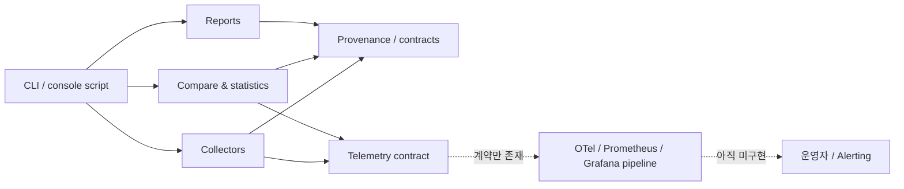

# OnMaru BE Pipeline Toolkit 개선 후 객관적 평가 보고서

작성일: 2026-09-23
평가 기준: `develop` 최신 커밋 `c904d7f`
이전 기준 보고서: [`architecture-observability-devops-assessment-2026-09-23.md`](./architecture-observability-devops-assessment-2026-09-23.md)

## 1. 결론

현재 프로젝트 평점은 **82/100점**이다. 이전 평가 73점 대비 **9점 상승**했다.

이번 개선으로 다음 항목은 실제 코드와 CI에서 확인할 수 있는 수준까지 올라왔다.

- 실행 가능한 CLI와 Python 패키지 진입점 추가
- 비루트 Docker 런타임 이미지 추가
- 수집기·비교·리포트·보안 모듈의 기능 범위 확장
- `toolkit_*` 메트릭 이름, 허용 라벨, 민감정보 제거를 포함한 텔레메트리 계약 추가
- CI 의존성 고정, 90% 소스 커버리지 게이트, dependency audit 아티팩트, workflow 보안 검증 추가
- 릴리즈·배포·실행 provenance를 식별할 수 있는 계약 추가

다만 현재 상태를 완성된 운영 플랫폼으로 보기는 어렵다. 가장 중요한 이유는 **텔레메트리 계약은 있지만 OpenTelemetry SDK/exporter, Prometheus endpoint, Grafana dashboard, Loki pipeline, Alertmanager rule, W3C trace propagation이 아직 없다**는 점이다. 따라서 현재는 “통제된 내부 사용 또는 production candidate”에 가깝고, 장애를 자동 탐지·분석해야 하는 외부 production 환경에는 추가 작업이 필요하다.

## 2. 평가 범위와 증거

평가는 backend architecture, backend implementation, observability architecture/engineering, DevOps, security/reliability, testing, documentation/governance 관점으로 수행했다. 평가는 선언문이 아니라 현재 저장소와 실행 결과를 근거로 했다.

| 항목 | 현재 확인된 증거 | 판정 |
|---|---|---|
| 테스트 | `python3 -m pytest -q` → **46 passed** | 양호 |
| 소스 커버리지 | `src/pipeline_toolkit/*` 기준 **92%**, 602 statements | 양호 |
| 검증 스크립트 | `bash scripts/verify_toolkit.sh` 통과 | 양호 |
| CI | Python 3.11, pinned CI dependencies, coverage gate, audit artifact, workflow security verification | 양호 |
| CLI | `version`, `validate`, `compare`, `report`; console script 등록 | 양호 |
| 실행 이미지 | Python 3.11 slim, non-root user, healthcheck | 부분 양호 |
| 텔레메트리 | low-cardinality label contract, run/correlation ID, redaction | 계약 단계 |
| 런타임 관측성 | OTel SDK/exporter, metrics endpoint, dashboard, alert rule | 미구현 |
| 브랜치 보호 | `Git Flow protected branches` active ruleset 확인; REST branch protection endpoint는 404 | 구성과 실제 enforcement를 분리 검증해야 함 |
| 열린 이슈/PR | 평가 시점 기준 open Issue 0, open PR 0 | 양호 |
| dependency audit | CI에서 artifact 생성; 현재 로컬 Python 3.9 경로에는 pytest 계열 advisory가 남음 | 개선 필요 |

## 3. 100점 평가표

| 평가 축 | 배점 | 이전 | 현재 | 변화 | 객관적 판단 |
|---|---:|---:|---:|---:|---|
| Backend architecture & modularity | 20 | 15 | **16** | +1 | 모듈 경계와 실행 진입점은 개선됐지만 확장 플러그인/서비스 경계는 더 필요 |
| Data/evidence model & correctness | 20 | 15 | **16** | +1 | provenance, release/deployment identity, 비교 정책이 강화됨 |
| Observability architecture & engineering | 15 | 6 | **9** | +3 | 계약·라벨·redaction은 추가됐지만 실제 수집·전송·시각화 계층은 없음 |
| DevOps & CI/CD | 20 | 12 | **15** | +3 | 재현성·검증·컨테이너 기반은 개선됐지만 image supply chain과 release automation이 미완성 |
| Security & execution reliability | 15 | 12 | **13** | +1 | timeout, signal, retry, allowlist, redaction이 양호하나 SBOM/signing과 격리가 부족 |
| Testing & verification | 10 | 9 | **9** | 0 | 높은 커버리지와 검증 스크립트는 좋지만 통합·실서비스 fixture가 제한적 |
| Documentation & governance | 5 | 4 | **4** | 0 | ADR/Issue/report 흐름은 좋지만 구현 현황 문서의 최신성 관리가 더 필요 |
| **합계** | **100** | **73** | **82** | **+9** | **내부 production candidate 수준** |

점수는 “구현 파일이 존재한다”만으로 가산하지 않았다. 실제 운영에 필요한 연결부가 없으면 계약·문서 수준의 성숙도로 제한했다.

## 4. 아키텍처 평가

### 4.1 현재 구조



### 4.2 잘한 부분

| 관점 | 근거 | 평가 |
|---|---|---|
| 모듈 분리 | collectors, compare, reports, runners, security, telemetry로 책임 분리 | 변경 영향 범위를 줄이는 방향 |
| 실행 진입점 | `pipeline-toolkit` console script와 `python -m` 사용 가능 구조 | 로컬·CI·컨테이너 실행 경로가 일관됨 |
| 계약 중심 설계 | release/deployment identity, provenance, telemetry model | 결과 재현성과 추적성의 기반 확보 |
| 실패 격리 | runner timeout, signal handling, retry/backoff, allowlist | 외부 명령 실행 도구의 위험을 일부 통제 |

### 4.3 부족한 부분

- GitHub API 계층은 실제 운영에서 pagination, rate-limit, retry budget, API error taxonomy를 더 명시해야 한다.
- collector 추가 시 공통 interface 또는 registry가 없어 기능이 커질수록 조건 분기와 중복이 늘어날 가능성이 있다.
- 현재 telemetry는 application event를 외부 backend로 보내는 adapter가 없다. 구조적으로는 “관측성 생산자”에서 멈춰 있다.
- Dockerfile은 존재하지만 CI가 image build, smoke test, vulnerability scan을 수행하지 않는다.
- 저장소가 실제로 사용하는 Python 버전 매트릭스와 packaging metadata의 검증 범위를 더 명확히 해야 한다.

## 5. Observability 평가

### 5.1 성숙도 매트릭스

| 영역 | 현재 상태 | 성숙도(5점) | 판단 |
|---|---|---:|---|
| Metric naming | `toolkit_*` prefix 계약 | 3 | 규칙은 있음 |
| Label cardinality | 허용 라벨 목록과 unknown label 차단 | 4 | 좋은 출발, 실제 backend 부하 검증 필요 |
| Correlation | `run_id`, `comparison_id`, `trace_id` 필드 | 3 | ID 모델은 있음 |
| Sensitive data | 재귀 redaction | 3 | 애플리케이션 이벤트에 적용 가능 |
| Trace propagation | W3C `traceparent` 생성·전파 | 1 | 미구현 |
| Metrics export | Prometheus/OpenMetrics endpoint/exporter | 1 | 미구현 |
| Logs | 구조화 로그 수집·보존·검색 pipeline | 1 | 미구현 |
| Dashboards | Grafana dashboard와 운영 패널 | 1 | 미구현 |
| Alerting/SLO | Alertmanager rule, SLI/SLO, runbook | 1 | 미구현 |
| **종합** | **계약은 확보, 운영 pipeline은 미완성** | **2.5/5** | 추가 구현 필요 |

### 5.2 객관적 판정

이번 telemetry 개선은 의미가 있다. 특히 허용 라벨을 제한하고 `run_id`를 필수화한 것은 고카디널리티와 상관관계 단절을 예방한다. 그러나 이것을 “observability 구축 완료”로 표현하면 과장이다.

최소 production 기준은 다음 흐름이 실제로 동작해야 한다.

```text
collector/runner
  → OpenTelemetry SDK 또는 Prometheus client
  → exporter / scrape endpoint
  → backend(OTel Collector, Prometheus, Loki, Tempo 등)
  → dashboard + alert rule
  → runbook + SLO/error budget
```

현재 저장소는 첫 단계의 이벤트 계약까지만 제공한다. 따라서 운영자 관점의 “실패를 언제 알 수 있는가”, “어디서 지연됐는가”, “어떤 배포가 영향을 줬는가”에 대한 자동 답변은 아직 보장되지 않는다.

## 6. DevOps와 배포 평가

### 6.1 개선된 부분

| 항목 | 현재 구현 | 판정 |
|---|---|---|
| CI 재현성 | `requirements-ci.txt` 버전 고정, Python 3.11 기준 | 양호 |
| 품질 게이트 | 소스 커버리지 90% 미만 실패 | 양호 |
| 의존성 점검 | `pip-audit` 결과 artifact 보존 | 부분 양호 |
| Workflow 안전성 | read-only permissions, concurrency, reusable workflow guard | 양호 |
| 컨테이너 | slim base, non-root, healthcheck | 부분 양호 |
| Git Flow | `develop` 통합, feature/fix/docs branch 정책 | 양호 |

### 6.2 남은 배포 리스크

1. dependency audit가 현재는 artifact와 warning 중심이다. 배포 차단 기준과 advisory 예외 만료 정책이 없다.
2. Docker image build/push, provenance attestation, SBOM, image signing, registry retention 정책이 없다.
3. `develop`에 active ruleset은 존재하지만 REST branch protection endpoint가 404이므로 required check가 실제 merge enforcement에 적용되는지 별도 확인이 필요하다.
4. Release Please 정책은 문서에 있으나 실제 release PR/tag/GitHub Release의 end-to-end 검증 증거는 부족하다.
5. packaging build에 사용되는 build backend의 완전한 lock과 artifact 설치 테스트가 없다.

## 7. 보안과 신뢰성 평가

### 강점

- 외부 명령 실행에 timeout과 signal 처리가 있다.
- retry/backoff, 허용된 command/tool 정책, 민감정보 redaction이 있다.
- CI workflow permission을 read-only로 제한했다.
- 실행·릴리즈 provenance를 남길 데이터 모델이 있다.
- secrets, raw benchmark data, consumer source를 커밋하지 않는 운영 규칙이 있다.

### 리스크

| 위험 | 영향 | 현재 완화 | 잔여 조치 |
|---|---|---|---|
| 악성/오작동 command | runner host 영향 | allowlist, timeout | container/sandbox 경계와 resource limit |
| 민감정보 유출 | 로그·리포트 노출 | redaction contract | 실제 모든 sink에 공통 middleware 적용 |
| 취약 dependency | CI/build 공급망 | pip-audit artifact | blocking policy와 exception expiry |
| 이미지 변조 | 배포 신뢰성 저하 | non-root image | SBOM, signing, digest pinning |
| API rate limit | 수집 실패/지연 | 일부 retry | rate-limit aware budget과 pagination test |

## 8. 테스트와 품질 평가

현재 46개 테스트가 통과하고 소스 기준 커버리지는 92%다. 이는 단위 테스트와 핵심 계약 검증에는 강한 상태다.

다만 다음 테스트가 추가되어야 “운영 검증” 점수를 올릴 수 있다.

- 실제 GitHub API 응답 fixture를 사용한 pagination/rate-limit/retry 통합 테스트
- Docker image build 후 CLI healthcheck와 non-root 실행 테스트
- telemetry export failure, exporter backpressure, malformed label 테스트
- workflow 호출 이벤트와 push 이벤트를 분리한 실제 GitHub Actions smoke 검증
- release PR 생성부터 tag/release artifact까지의 end-to-end 테스트

## 9. 우선순위별 개선안

| 우선순위 | 개선 작업 | 완료 판정 기준 | 기대 효과 |
|---|---|---|---|
| P0 | OTel/Prometheus export adapter 구현 | run 단위 metric/log/trace가 수집 backend에서 조회됨 | observability 9→12점 |
| P0 | Docker CI supply chain 추가 | build, smoke test, SBOM, scan, signing, digest 기록 | DevOps·보안 상승 |
| P0 | ruleset required checks 실효성 검증 | 보호된 branch에 required `ci`가 실제 merge gate로 적용됨 | merge 안전성 확보 |
| P1 | SLI/SLO 및 alert/runbook 작성 | 성공률·지연·수집 실패 alert와 대응 절차가 연결됨 | 운영 가능성 상승 |
| P1 | GitHub API 통합 테스트 | pagination/rate-limit/error taxonomy가 fixture로 검증됨 | 수집 안정성 상승 |
| P1 | audit blocking/exception 정책 | high severity 차단, 예외 만료일과 owner 지정 | 공급망 위험 감소 |
| P2 | collector registry/plugin boundary | 신규 collector가 공통 interface로 추가됨 | 유지보수 비용 감소 |
| P2 | 최신 구현 현황 문서 자동 검증 | stale gap 문서와 실제 상태가 drift하지 않음 | 거버넌스 신뢰성 향상 |

## 10. 최종 평가

**잘한 부분:** 이번 개선은 단순 문서 보강이 아니라 CLI, 실행 이미지, 텔레메트리 계약, CI 품질 게이트, provenance까지 실제 저장소에 반영했다. 특히 46개 테스트, 92% 소스 커버리지, reusable workflow 보안 보강은 구현 신뢰도를 높인다.

**부족한 부분:** observability와 DevOps의 “운영 연결부”가 아직 빠져 있다. 계약·검증·이미지는 있지만, 실제 metric/log/trace backend, dashboard, alert, signed release artifact가 없다. 이 때문에 점수를 80점대 초반에서 제한했다.

**종합 판정:** 현재 프로젝트는 **구조화된 내부 도구 또는 제한된 production candidate로는 충분히 진전된 상태**다. 다중 팀·고가용성·감사 가능한 production 서비스로 승격하려면 P0의 telemetry export, image supply chain, branch protection enforcement 검증을 먼저 완료해야 한다.

평가 신뢰도를 높이기 위해 다음 재평가 조건을 권장한다.

```text
P0 완료
  → CI와 image smoke 검증
  → 실제 observability backend에서 run/correlation 조회
  → alert firing 및 runbook drill
  → 동일 rubric으로 재평가
```
