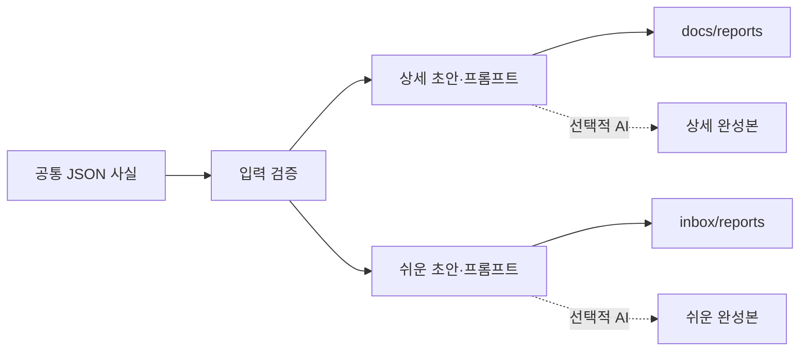

# Report Bundle: 하나의 관측 사실에서 두 독자용 보고서를 생성하는 설계

- 상태: 제안됨
- 관련 이슈: #56
- 대상: `pipeline-toolkit` CLI와 보고서 출력 경계

## 문제와 목표

CI·테스트·CD·benchmark 결과를 기록할 때 개발자용 상세 보고서와 비개발자·포트폴리오용 쉬운 보고서는 같은 사실을 다른 언어로 설명한다. 현재는 두 문서를 각각 작성해야 하므로 수치가 어긋나거나, 실패한 후보 실행이 쉬운 문서에서 성과처럼 표현될 위험이 있다.

`report-bundle`은 관측 사실을 한 번만 구조화해 입력받고 두 결과물을 함께 만든다. 공식 상세판은 toolkit 저장소의 `docs/reports`에, 쉬운판은 저장소 밖 `OnMaru/inbox/reports`에 둔다. 기본 실행은 네트워크 호출과 파일 쓰기를 하지 않으며, AI 완성본은 명시적인 opt-in일 때만 생성한다.

## 고려한 방식과 선택

| 방식 | 장점 | 한계 | 결정 |
| --- | --- | --- | --- |
| AI API만 호출 | 자연스러운 서술을 즉시 생성 | 키·비용·네트워크 실패에 의존하고 재현성이 낮음 | 채택하지 않음 |
| 템플릿만 생성 | 결정론적이고 오프라인 동작 | 쉬운 서술의 품질이 제한됨 | 단독으로는 채택하지 않음 |
| 공통 입력 + 템플릿 + 선택적 AI | 안전한 기본값과 자연어 완성본을 모두 제공 | 입력 스키마와 출력 검증이 필요 | **채택** |

## 사용자 인터페이스

```bash
# 기본값: 출력 예정 경로와 생성 내용을 stdout으로만 보여 준다.
pipeline-toolkit report-bundle \
  --input ci-observation.json \
  --slug onmaru-backend-ci

# 결정론적 초안·프롬프트를 실제 경로에 쓴다.
pipeline-toolkit report-bundle \
  --input ci-observation.json \
  --slug onmaru-backend-ci \
  --write

# write와 함께 선택적 AI 완성본을 생성한다.
OPENAI_API_KEY=... pipeline-toolkit report-bundle \
  --input ci-observation.json \
  --slug onmaru-backend-ci \
  --write \
  --ai-provider openai \
  --model <explicit-model>
```

`--write` 없이 실행하면 파일 시스템을 바꾸지 않는다. `--ai-provider`를 지정하지 않으면 네트워크 요청을 하지 않는다. AI 모드에서 키가 없거나 응답이 유효하지 않으면 명령은 실패하고 기존 파일을 덮어쓰지 않는다.

## 공통 입력 계약

입력은 UTF-8 JSON이며, 사람의 설명과 검증 가능한 수치를 분리한다.

```json
{
  "title": "OnMaru Backend CI 관측",
  "observed_at": "2026-09-24",
  "summary": "CI 병목과 병렬 후보를 관측했다.",
  "facts": [
    {
      "name": "serial verify",
      "value": 454,
      "unit": "seconds",
      "status": "success",
      "source_url": "https://github.com/.../actions/runs/...",
      "comparable": false
    }
  ],
  "changes": ["module matrix fan-out 도입"],
  "limitations": ["동일 SHA 반복 표본 부족"],
  "next_steps": ["동일 조건에서 3회 반복 측정"],
  "portfolio_claims": ["병목을 계측하고 병렬 실행 구조를 구축했다."]
}
```

필수 필드는 `title`, `observed_at`, `summary`, `facts`, `limitations`, `next_steps`다. `facts`의 각 항목은 `name`, `value`, `unit`, `status`, `source_url`, `comparable`을 가져야 한다. `status`는 `success`, `failed`, `cancelled`, `timeout`, `missing` 중 하나다.

`success`이면서 `comparable: true`인 표본만 개선·회귀 계산 후보가 된다. failed, cancelled, timeout, missing 또는 `comparable: false` 표본은 보고서에 원인과 관측값으로 남기되 개선율 계산에서 제외한다.

## 구성 요소와 데이터 흐름



### 입력 검증기

스키마, URL 형식, 날짜, slug, 숫자 단위, 상태 열거형을 확인한다. credential-bearing URL, 제어 문자, 경로 순회 문자열, secret처럼 보이는 값은 거부한다. 검증 실패 시 출력 파일과 네트워크 요청은 발생하지 않는다.

### 결정론적 renderer

동일 입력에서 항상 동일한 Markdown 초안과 prompt packet을 만든다. 상세 초안은 관측 범위·근거 품질·변경·병목·한계·다음 측정으로 구성한다. 쉬운 초안은 문제·왜 중요한가·무엇을 바꿨나·확정된 결과·아직 모르는 것·포트폴리오 문장으로 구성한다.

### 선택적 AI adapter

AI adapter는 renderer가 만든 prompt packet과 검증된 공통 사실만 전송한다. API 키는 환경 변수에서만 읽고 로그·artifact·출력 Markdown에 절대 기록하지 않는다. provider와 model은 사용자가 명시한다. 응답은 Markdown 구조, 필수 섹션, source URL 보존, 금지된 개선 주장 여부를 검증한 뒤에만 output 후보가 된다.

### writer

writer는 `--write`가 있을 때만 실행된다. 상세 출력은 저장소 내부 `docs/reports/YYYY-MM-DD-<slug>-detailed.md`와 prompt packet 경로에 쓴다. 쉬운 출력은 구성 가능한 inbox root의 `reports/YYYY-MM-DD-<slug>-easy.md`와 prompt packet 경로에 쓴다. 기본 inbox root는 현재 workspace의 상위 `inbox`이며, `--inbox-root`로 명시적으로 바꿀 수 있다.

동일 경로가 이미 있으면 기본적으로 실패한다. `--overwrite`는 `--write`와 함께만 허용하며, overwrite 전에 출력 대상이 허용 root 아래에 있는지 다시 검증한다.

## 출력 경계

| 출력 | 독자 | 기본 경로 | Git 흐름 |
| --- | --- | --- | --- |
| 상세 기술 보고서 | 개발자·운영자 | `docs/reports/` | 코드와 함께 PR·CI·merge |
| 상세 prompt packet | 개발자·AI 생성 adapter | `docs/reports/prompts/generated/` | 상세 보고서와 같은 PR |
| 쉬운 보고서 | 비개발자·포트폴리오 독자 | `<inbox-root>/reports/` | 저장소 밖, PR 없음 |
| 쉬운 prompt packet | 대화형 AI·개인 작성 | `<inbox-root>/reports/prompts/generated/` | 저장소 밖, PR 없음 |

AI 생성 결과도 이 경계를 유지한다. AI 모드가 있다고 해서 inbox 결과가 git 상태를 바꾸거나, 상세 결과가 자동으로 push·PR·merge되는 일은 없다.

## 실패 처리와 안전성

| 상황 | 동작 |
| --- | --- |
| JSON 또는 스키마 오류 | 입력 오류와 field path를 stderr로 출력, exit 2, write/API 미실행 |
| secret·credential URL 탐지 | 안전 오류, exit 2, 원문 값은 출력하지 않음 |
| output 경로가 허용 root 밖 | 안전 오류, exit 2 |
| 파일 존재 | overwrite 없이 exit 1 |
| AI 키 없음·provider 오류·네트워크 오류 | AI 결과 미작성, 결정론적 초안은 `--write` 여부에 따라 유지, exit 1 |
| AI Markdown 검증 실패 | AI 결과 미작성, 검증 오류만 출력, exit 1 |

기본 renderer와 AI adapter는 분리한다. 따라서 AI 장애가 측정 데이터·기존 보고서를 손상시키지 않는다.

## 테스트 전략

- valid input에서 상세·쉬운 초안과 prompt packet이 결정론적으로 생성되는지 확인한다.
- `--write` 없이 저장소와 inbox가 바뀌지 않는지 확인한다.
- `--write`가 두 허용 root에만 쓰는지 확인한다.
- invalid status, 잘못된 URL, path traversal, secret 문자열, 누락 필드를 fail-closed로 검사한다.
- failed/non-comparable 표본이 improvement 표현이나 delta 계산에 포함되지 않는지 확인한다.
- AI adapter는 HTTP를 mock해 키 누출 금지, 명시적 provider/model 요구, 실패 시 atomic write를 확인한다.
- 기존 `report` CLI의 JSON·Markdown·HTML renderer 계약이 변하지 않는지 회귀 검증한다.

## 완료 기준

1. 하나의 유효한 입력으로 두 독자용 초안과 prompt packet을 생성할 수 있다.
2. AI 없는 로컬 모드가 네트워크·파일 변경 없이 유용한 결과를 반환한다.
3. `--write`와 명시적 output 경계 없이는 파일이 생성되지 않는다.
4. AI 모드는 opt-in이며 key/model/provider가 명시돼야 한다.
5. 실패·비교 불가 표본은 어떠한 출력에서도 성과 수치로 바뀌지 않는다.
6. 공식 상세 보고서는 PR로, 쉬운 보고서는 inbox로 분리된다.
