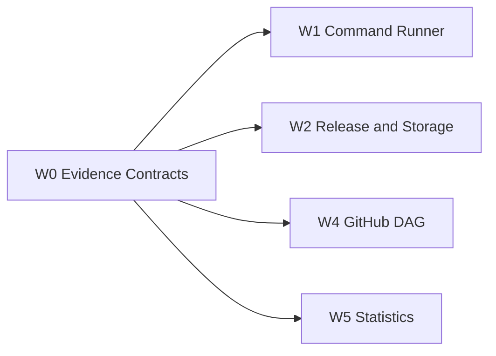

## Objective

Define the versioned unified evidence contracts and fixtures consumed by all runners, collectors, analyzers, and renderers.

## Scope

Schemas and enums for stage/test/pipeline/release/run/comparison records, provenance, execution/environment/time semantics, quality states, validation, and representative fixtures.

## Dependencies

- Blocked-by: none (Wave 0)
- Blocks: #3, #4, #5, #6

## Position in Graph

## Expected Touch Points

- `schemas/`
- `src/pipeline_toolkit/contracts/`
- `src/pipeline_toolkit/normalize/`
- `tests/fixtures/schemas/`

## Acceptance Criteria

- [ ] Versioned schemas validate stage, test, pipeline, release, benchmark-run, and comparison records.
- [ ] Source, execution, environment, time, quality, and provenance fields are represented.
- [ ] Missing, partial, invalid, timeout, and inconclusive records are distinct from success.
- [ ] Schema mismatch and migration/compatibility cases are tested.
- [ ] JUnit, pytest, GitHub Actions, Docker, and system fixtures exist.

## Verification

Schema validation, fixture round-trip, and deterministic normalization tests.
