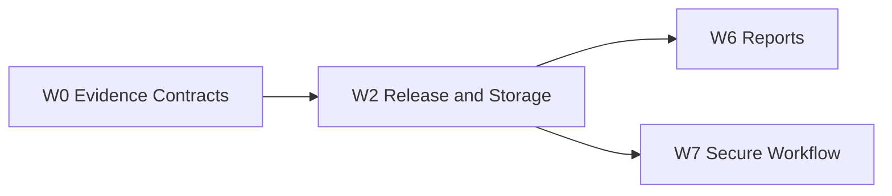

## Objective

Implement release, deployment, BenchmarkRun, Comparison, and artifact manifest contracts for release-aware evidence storage.

## Dependencies

- Blocked-by: #2
- Blocks: #8, #9

## Position in Graph

## Scope

Release tag/commit/image identity, deployment environment, benchmark-run metadata, baseline reference, comparison references, artifact URI/checksum manifest, and GitHub Artifact publish contract.

## Expected Touch Points

- `src/pipeline_toolkit/provenance/`
- `src/pipeline_toolkit/reports/`
- `schemas/release*.json`
- `schemas/benchmark*.json`

## Acceptance Criteria

- [ ] Release metadata requires repository, version/tag, commit SHA, and image digest.
- [ ] BenchmarkRun records environment, suite, config hash, runner profile, and artifact manifest.
- [ ] Comparison references both releases and every contributing run ID.
- [ ] Manifest contains raw, normalized, report URIs and checksums.
- [ ] Tag-only identity, digest mismatch, duplicate artifact, and missing baseline are tested.

## Verification

Schema/contract tests and deterministic manifest generation with release fixtures.
