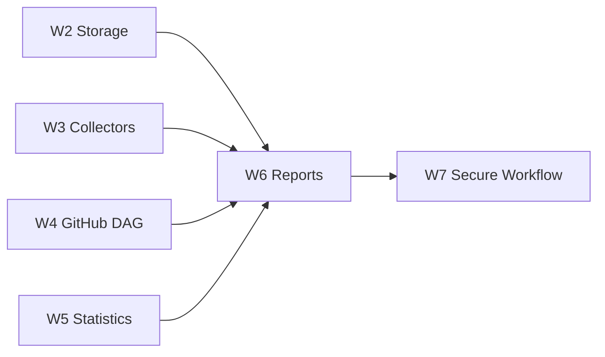

## Objective

Generate deterministic PNG/HTML/Markdown/JSON/Job Summary outputs from normalized and analyzed evidence.

## Dependencies

- Blocked-by: #4, #7, #5, #6
- Blocks: #9

## Position in Graph

## Scope

Report model, timeline, before/after, stage, resource, cache, DAG/critical path, affected module, provenance, missing-data indicators, top-N behavior, Markdown, HTML, JSON, and Job Summary.

## Expected Touch Points

- `src/pipeline_toolkit/visualization/`
- `src/pipeline_toolkit/reports/`
- `resources/report/templates/`
- `tests/fixtures/reports/`

## Acceptance Criteria

- [ ] Report includes wall-clock, work duration, critical path, baseline/candidate, samples, and regression status.
- [ ] Missing, partial, estimated, and inconclusive data are visible.
- [ ] PNG, HTML, Markdown, JSON, and Job Summary derive from one report model.
- [ ] Values link to normalized records and raw artifact URIs.
- [ ] Large module/test sets have deterministic top-N, pagination, and tie handling.
- [ ] Identical input produces identical structured output.

## Verification

Golden report fixtures, deterministic rendering tests, HTML escaping checks, and Job Summary snapshots.
