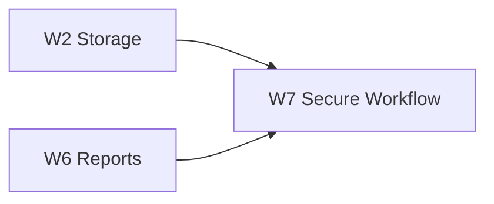

## Objective

Provide a least-privilege reusable GitHub workflow and document OnMaru-backend adoption.

## Dependencies

- Blocked-by: #4, #8
- Blocks: none

## Position in Graph

## Scope

Reusable workflow/action, release register input, benchmark compare/publish, staging smoke gate, artifact retention, fork-PR isolation, redaction, protected production environment, and OnMaru consumer configuration.

## Expected Touch Points

- `.github/workflows/`
- `.github/actions/`
- `docs/to-be/`
- `scripts/`
- `examples/onmaru/`

## Acceptance Criteria

- [ ] Consumer workflow passes release tag, commit SHA, image digest, environment, suite, and config.
- [ ] PR workflows use `contents:read` and do not expose release/deployment secrets to fork PRs.
- [ ] Release workflow publishes metadata, artifacts, comparison report, and Job Summary.
- [ ] Staging smoke validation checks deployed image digest before comparison.
- [ ] Production promotion uses explicit approval or documented warning-only policy.
- [ ] OnMaru adoption documentation includes commands, storage mapping, failure modes, and verification.

## Verification

Workflow YAML validation, shell verification, mocked consumer fixture, permission review, redaction test, and end-to-end fixture run.
