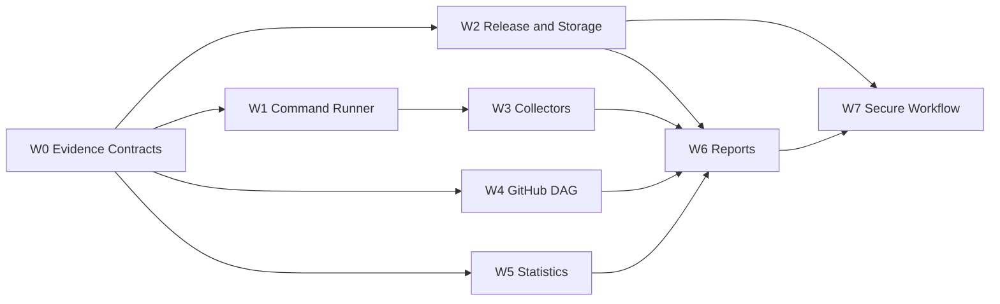

## Goal

Build a reusable release-aware CI/CD benchmark toolkit for OnMaru-backend and similar Spring Boot, Gradle multi-module, and FastAPI repositories.

## Background / Motivation

The PRD defines an evidence lifecycle from inspect and measure through normalization, DAG analysis, visualization, reporting, and optimization. The toolkit must compare previous and current release tags without copying consumer source or storing benchmark raw data in the service database.

## Scope

Versioned evidence contracts, reliable command execution, release/deployment identity, source collectors, GitHub Actions DAG and critical path analysis, repeated statistical comparison, regression detection, deterministic reports, secure reusable workflows, and OnMaru adoption contracts.

## Out of Scope

Production business APIs, copying OnMaru-backend source/tests, changing the OnMaru service database schema, automatic production rollback, and provisioning external storage infrastructure.

## Child Issues

- [ ] #2 Evidence contracts and fixtures
- [ ] #3 Reliable command runner and raw artifacts
- [ ] #4 Release/deployment/storage contracts
- [ ] #7 JUnit/pytest/Gradle/Docker/system collectors
- [ ] #5 GitHub Actions DAG and critical path
- [ ] #6 Statistical comparison and regression
- [ ] #8 Deterministic visualizations and reports
- [ ] #9 Secure reusable workflow and OnMaru adoption

## Dependency Graph

## Execution Waves

- Wave 0: W0
- Wave 1: W1, W2, W4, W5 (parallel)
- Wave 2: W3
- Wave 3: W6
- Wave 4: W7

## Integration Gates

- Wave 0 → schema validation and fixture round-trip checks → Wave 1
- Wave 1 → command, release, GitHub API, and statistics tests → Wave 2
- Wave 2 → collector normalization and provenance checks → Wave 3
- Wave 3 → deterministic report and artifact traceability checks → Wave 4
- Wave 4 → secure consumer workflow fixture and end-to-end comparison → release adoption

## Success Criteria

- Release tag, commit SHA, and image digest identify every benchmark result.
- Previous/current tag comparison supports repeated samples and `inconclusive` results.
- Work duration, wall-clock, DAG, and critical path are correct for serial/parallel/matrix/retry cases.
- Raw, normalized, visual, Markdown, HTML, JSON, and Job Summary outputs are traceable.
- Consumer workflow is least-privilege and fork-PR safe.

## Definition of Done

- All child issue acceptance criteria pass.
- No unresolved graph dependency or conflict candidate remains.
- Release comparison fixtures reproduce the same report from the same raw inputs.
- Reusable workflow and security checks pass.
