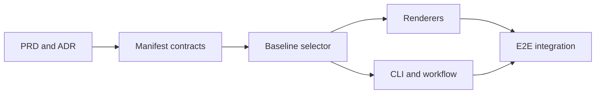

## Goal

Provide evidence-backed comparisons with the previous comparable release, a specific requested release, and historical trends without turning incomplete CI data into a performance claim.

## Scope

Immutable versioned manifests, baseline selection, deterministic renderers, local-history CLI/workflow convention, and end-to-end validation. This extends the reusable control-plane work in #31.

## Out of Scope

Hosted storage, direct GitHub API access in the core CLI, deployment changes, and automated promotion.

## Success Criteria

- Previous selection uses immutable identity and exact run-condition compatibility.
- Explicit version selection returns named `inconclusive` reasons instead of silently choosing a different release.
- Reports expose provenance, samples, status, and exclusions in every format.

## Child Issues

Numbers are populated after GitHub Issue creation; the checked-in graph remains the canonical planned topology.

## Dependency Graph

T0 → T1 → T2 → {T3, T4} → T5.

## Execution Waves

- Wave 0: documentation and ADR.
- Wave 1: manifest contract.
- Wave 2: baseline selector/comparison service.
- Wave 3: renderer and CLI/workflow implementation in parallel.
- Wave 4: end-to-end fixture and documentation.

## Integration Gates

- Wave 1: manifest parser tests and schema safety checks pass.
- Wave 2: previous/explicit incompatibility tests pass before renderer or CLI integration.
- Wave 3: merge renderer and CLI/workflow, then run the complete verification script.
- Wave 4: one multi-version fixture exercises the assembled lifecycle.

## Risks

Artifact retention gaps, mutable tags, and CI environment drift can otherwise create false comparisons. The manifest identity and fail-closed policy mitigate these risks.

## Definition of Done

All child issues are merged into `develop`, all required checks pass, and the root issue is closed after verification.
